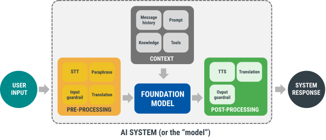

# What is Model Evaluation

This level focuses on evaluating the technical performance of an AI system on standardized metrics and benchmarks, independent of how people use it or the real-world outcomes it produces. Level 1 evaluation is the foundational "stress test" for your AI. It moves beyond simple code checks to verify the "smarts" of your product. Because Large Language Models (LLMs) predict the next word rather than "understanding" reality, they are prone to hallucinations, static knowledge gaps, and instruction failure.

This level of evaluation ensures your system is useful, accurate, and safe before it reaches a single user.


**Note:** The levels are not strictly sequential. Teams may run Levels 1, 2, and 3 in parallel, and revisit earlier levels as new results emerge


***

#### Core Concept: The "Cell" vs. The "Nucleus"

In this playbook, we will distinguish between two different concepts:

**Foundation Model (The "Nucleus")**: This is a large-scale model, trained on vast datasets, used as part of an overall system. Examples: GPT-5, Claude Opus 4.5, Gemini 3

**End-to-End AI System (The "Cell")**: This is the entire AI workflow or system that you build. It incorporates one or more foundation models, plus all the other components that make the pipeline work for a user. Just as a cell contains a nucleus, mitochondria (for energy) and a cell wall, your full pipeline will include multiple components, like:

* Knowledge bases containing specific information for retrieval
* Instructions for the AI model (“system prompt”) and safety guardrails, like content filters
* Language translation, speech-to-text/text-to-speech transformations, and other processing steps
* Tools that let the model take actions like sending an email or performing web search

When we say “AI system”, we generally are referring to the End-to-End AI System described above. To avoid confusion, we will always use the term foundation model when referring to the “nucleus” and use “AI system” or “AI pipeline” when referring to the “cell”.

To simplify the evaluation of an AI system, we define three distinct components:&#x20;



Before a user input hits the foundation model, it is transformed into a suitable format. Common steps include:

* Sanitization: Rejecting unsafe or irrelevant inputs
* Conversion: Turning speech into text (e.g. using an automatic speech recognition model)
* Refinement: Paraphrasing the request (e.g. converting a vague message to more specific based on the conversation history) or translating it from a low-resource language to a high-resource one (since LLMs perform better in high-resource languages)



Beyond the user’s pre-processed request, a foundation model requires the following additional components to function:

* The “system prompt”: These instructions guide the foundation model’s behavior.
* External Tools: These augment the foundation model by letting it take actions (e.g. web search)
* Context: Relevant background, such as conversation history, data retrieved from a knowledge base, or responses received from calling tools (e.g. web search results).



Before the output reaches the user, it undergoes final checks and transformations. Common steps include:

* Quality Control: Checking for hallucinations (e.g. by ensuring the response is always grounded in the knowledge base) and verifying safety guardrails as defined by you
* Formatting: Converting text to speech or translating the answer back into the user’s preferred language.



Level 1 evaluations should cover this entire pipeline. They assess your complete AI system, from the user's input to the final output, verifying that each piece of the pipeline exhibits desirable behaviors. You can (and should) test individual components of this workflow using unit tests. Note that others have written at length on the topic of [unit testing](#user-content-fn-1)[^1], and it is not covered here in detail.

Remember that AI solutions can take many forms. They can be chatbots, voice bots for real-time conversation, or agents that take actions, like filling out our forms or calling external services. Level 1 evaluations cover all these modalities.

***

#### Example: an AI agronomist deployed in Senegal

Consider a product answering questions from farmers in Pulaar. The AI system includes the three components as follows:

<table data-header-hidden="false" data-header-sticky><thead><tr><th width="203.69140625" valign="top">Component</th><th valign="top">Workflow Steps</th></tr></thead><tbody><tr><td valign="top">Pre-processing</td><td valign="top"><ul><li>Check input for malicious or off-topic content (filtering model)</li><li>Translate query from Pulaar to English (translation model)</li></ul></td></tr><tr><td valign="top">Context Preparation</td><td valign="top"><ul><li>Retrieve relevant agricultural content from the database</li><li>Retrieve specific information about the farmer from the context window</li><li>Generate response to processed user input (large language model)</li></ul></td></tr><tr><td valign="top">Post-processing</td><td valign="top"><ul><li>Verify the answer is grounded in the content provided in your knowledge base</li><li>Translate the response back to Pulaar (translation model)</li></ul></td></tr></tbody></table>



***

💬 Want to suggest edits or provide feedback?

{% embed url="https://tally.so/r/A788l0?originPage=level-1-model-evaluation%2Foverview" %}

[^1]: e.g. [Unit tests for AI models](https://hamel.dev/blog/posts/evals/#level-1-unit-tests) by Hamel Husain.

    Numerous books exist on unit testing. We found chapters 11-14 of Software Engineering at Google especially useful when building right sized, right scope, and repeatable tests.
