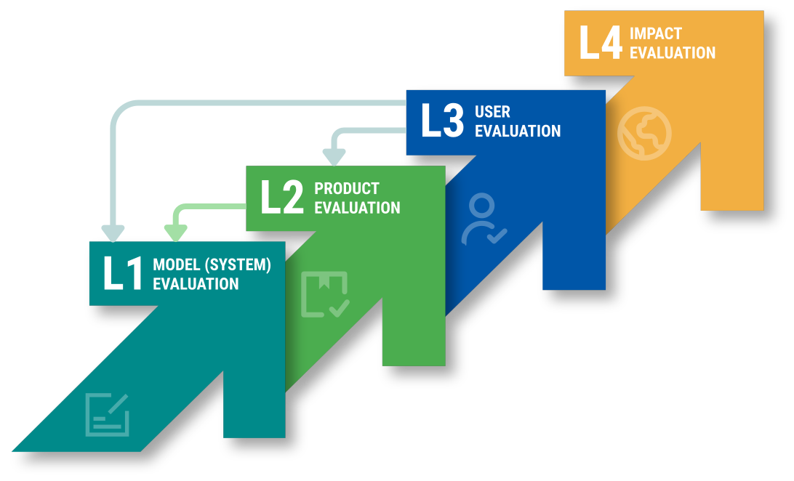

# About this playbook

From math tutors to farmer advisory tools, generative AI (GenAI) is rapidly expanding across low- and middle-income countries. This playbook provides a 4-level framework and recommends practices for evaluating these GenAI tools.

 

<figure><figcaption></figcaption></figure>

### Why we need this playbook

Evaluating GenAI products can mean different things depending on who you ask. Tech teams prioritize performance, often overlooking impact, while impact evaluators focus on outcomes but may neglect the underlying technology. Even within disciplines, the sophistication and quality of evaluations can differ.

This playbook establishes a unified set of expectations and practices for evaluating GenAI products in global development.

<table data-view="cards"><thead><tr><th></th><th></th><th></th></tr></thead><tbody><tr><td><h4><i class="fa-memo-circle-check">:memo-circle-check:</i></h4></td><td><strong>Create Shared Practices</strong></td><td>Use consistent, credible, and comparable practices to assess what works and drive learning across the industry.</td></tr><tr><td><h4><i class="fa-arrow-up-right-dots">:arrow-up-right-dots:</i></h4></td><td><strong>Improve Products and Programs</strong></td><td>Identify issues early through continuous evaluation and build better products over time.</td></tr><tr><td><h4><i class="fa-user-shield">:user-shield:</i></h4></td><td><strong>Demonstrate Accountability</strong></td><td>Show stakeholders measurable progress from model performance to impact.</td></tr></tbody></table>

### Who is this playbook for



### How to use this playbook

The playbook is organized around a 4-level framework that asks the following evaluation questions:



Each level outlines detailed evaluation practices for organizations building AI products to pursue.

The four levels form a logical progressio&#x6E;_._ Users are unlikely to stay engaged (Level 2) if the GenAI system fails to perform (Level 1), and development outcomes are unlikely to improve (Level 4) if users disengage or their feelings, knowledge, and behaviors are harmed (Level 3).

The playbook helps implementers conduct continuous evaluation across levels. Often, the results of one level of evaluation may require revisiting the performance of a preceding level. Amidst evolving technology, this enables rapid iteration, maintains expected behavior, and improves performance and impact over time.

### Setting the Foundation

To move from a promising AI prototype to a scalable tool for social impact, you need more than just sophisticated code—edging toward real-world change requires a deliberate combination of people and process.


This section of the Playbook **outlines the two foundational pillars of your evaluation journey**: assembling a multidisciplinary team and establishing the technical and conceptual infrastructure to measure success.




#### Additional Resources

[FAQs](additional-resources/frequently-asked-questions.md) | [Glossary](additional-resources/glossary.md) | [Minimal Viable Evaluations](additional-resources/minimum-viable-evaluations.md) | [Tools & Templates](additional-resources/additional-resources.md)

#### Stay involved

* [See the process behind the playbook](getting-started-1/the-process-behind-this-playbook.md)
* [Contribute to this playbook](getting-started-1/how-to-contribute-to-the-playbook.md) 


**This is a living playbook.** It will be updated regularly, with deeper collaboration with specialists to co-create shared evaluation tools, refine methodologies, and support their practical use in real-world settings.


***


**Note: This playbook can be used directly with AI tools like Claude, ChatGPT, and NotebookLM.** \
[_**Explore how**_**&#x20;>**](additional-resources/using-the-playbook-with-ai-tools.md)


***

💬 Want to suggest edits or provide feedback?

{% embed url="https://tally.so/r/A788l0?originPage=level-1-model-evaluation%2Foverview" %}

