---
layout:
  width: default
  title:
    visible: true
  description:
    visible: true
  tableOfContents:
    visible: true
  outline:
    visible: false
  pagination:
    visible: true
  metadata:
    visible: true
  tags:
    visible: true
  actions:
    visible: true
metaLinks:
  alternates:
    - '[object%20Object]/'
---

# Using the Playbook with AI Tools

You don't need to read through the entire playbook every time you want to apply the 4-level framework. This page shows you five ways to bring the playbook directly into the AI tools you're already using so that the playbook can seamlessly integrate with your existing workflows.

Each option comes with a tradeoff in terms of ease of setting up and the features that are available to you. Choose the option that best suits your needs.

## Skills

**Best for: Answering questions on evaluation and preparing artifacts like slides/docs/reports.**

A "skill" that extends Claude's capabilities by giving it access to specialized knowledge and workflows. For example, a talented presenter can create a "skill" explaining the techniques they use to make engaging presentations. This skill can then be used to help others learn from their expertise and mimic their presentation style.

A skill file is a simple text file that contains the specialized knowledge and workflows. It can be uploaded to your AI tool of choice and used to answer your questions following the instructions in the skill file.

To know more about `Skills`, please refer to [this](https://support.claude.com/en/articles/12512176-what-are-skills) blog post by Anthropic and [this](https://youtu.be/a3uMv1S-1tM) step-by-step tutorial on using Claude skills.

We have created a skill file for the AI Evaluation Playbook that answers your questions on evaluation using the 4-level framework. You can download it from [here](../skills/ai-eval-playbook-guide.skill.md).

### Adding the playbook skill to Claude

Open [Claude](https://claude.ai).

Click on `Customize`

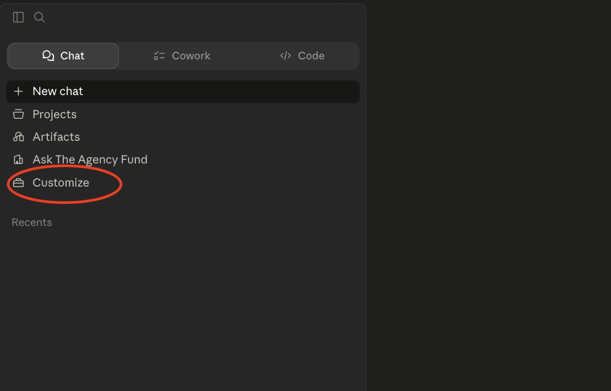

Open `Skills`

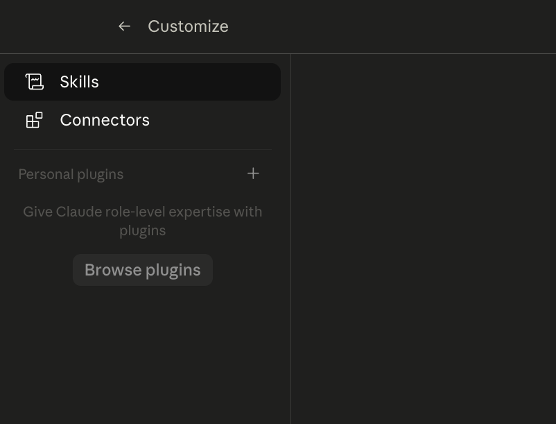

Click on `Add skill`

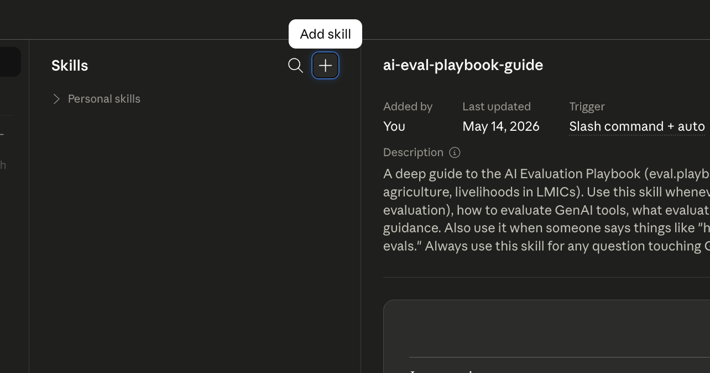

Select `Create skill` -> `Upload a skill`

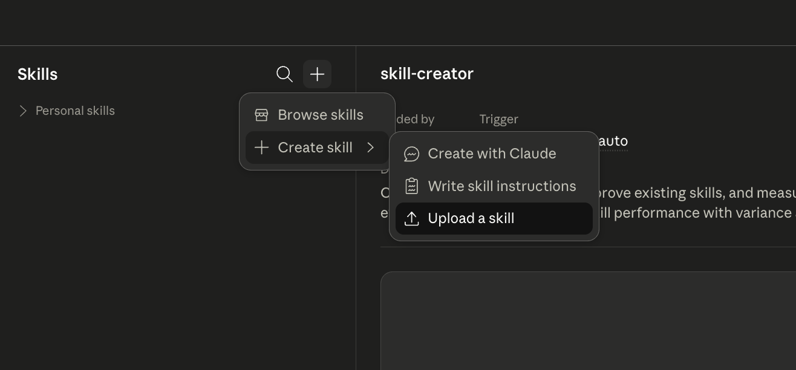

Upload the skill file you downloaded above

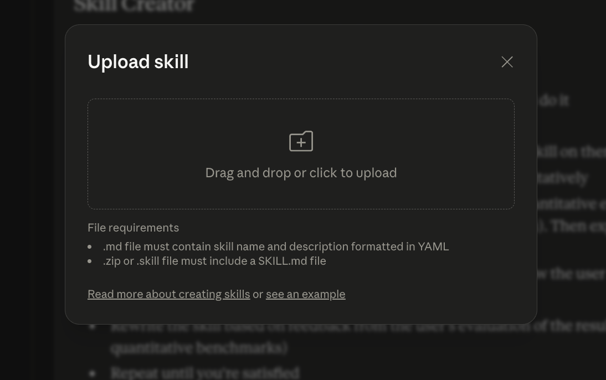

Once uploaded, you will see the `ai-eval-playbook-guide` skill in the list of skills.

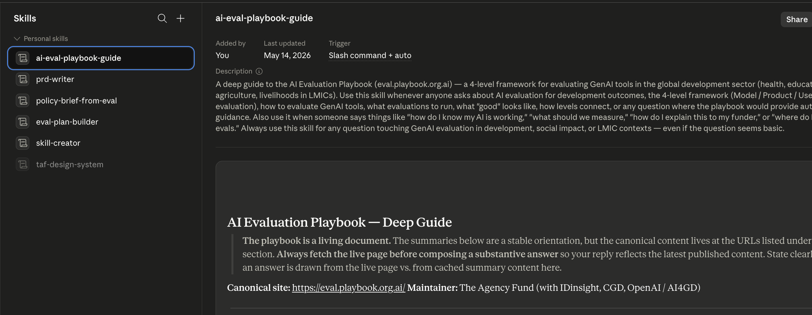

### Using the playbook skill

To use the skill, you can start a new conversation with Claude and ask your evaluation-related questions. You can specifically ask Claude to use the playbook skill or refer to the 4-level evaluation framework to answer the question. Claude will read the skill file and answer the question based on the relevant sections in the playbook.

For example, ask the following question:

```
We built a Theory of Change 12 months ago for an AI literacy tutor in rural India. Now we have:

Level 1 accuracy data (87% on golden dataset), Level 2 data (35% week-4 retention, most drop-off at onboarding), and Level 3 data (self-efficacy scores improving but knowledge test scores flat).

Using the framework linkages guidance in the AI Evaluation Playbook, stress-test our Theory of Change against this evidence.


Are we ready for a Level 4 RCT? Output this as a structured memo I can share with our funder.
```

Claude will start reading the skill file:

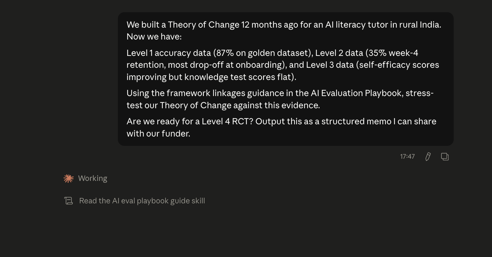

The final response for this question is generated using the 4-level framework:

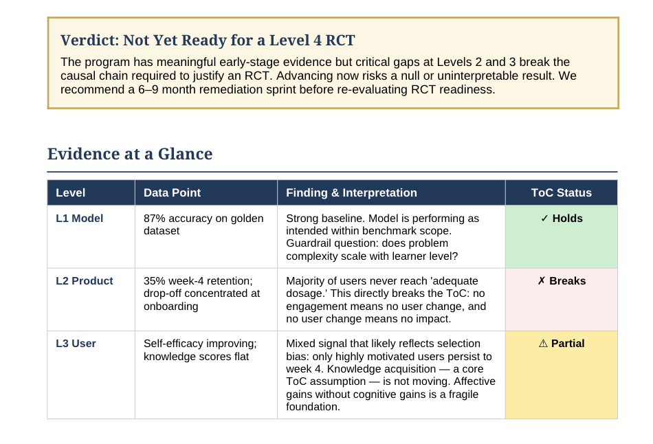

## NotebookLM

**Best for: Learning the framework, exploring ideas, and getting answers grounded only in the playbook.**

[NotebookLM](https://notebooklm.google) is a free AI-research tool by Google that lets you upload documents as "sources" and then ask questions about them to get answers that cite specific sections from the source documents.

When you add the playbook as a source, every answer it gives you is drawn directly from the playbook — nothing made up, nothing from outside. It also shows the specific sections from the playbook that were used to generate the answer, a feature unique to NotebookLM.

This makes it a great option if you're new to the framework and want to explore it, or if you want to be confident that responses are grounded in the actual content.

### Connecting the playbook to NotebookLM

Open [NotebookLM](https://notebooklm.google.com/) and create a new notebook.

Add `https://eval.playbook.org.ai` as a source for the notebook.

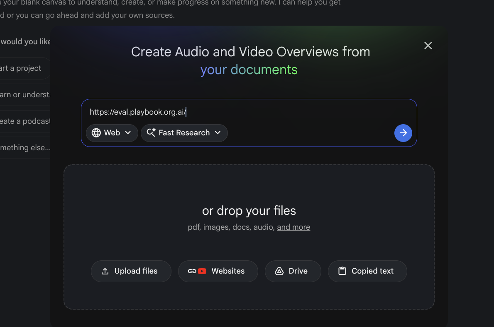

Wait for 1 minute for NotebookLM to process the playbook content. Once it is ready, you will see a summary of the playbook shown as description of the notebook.

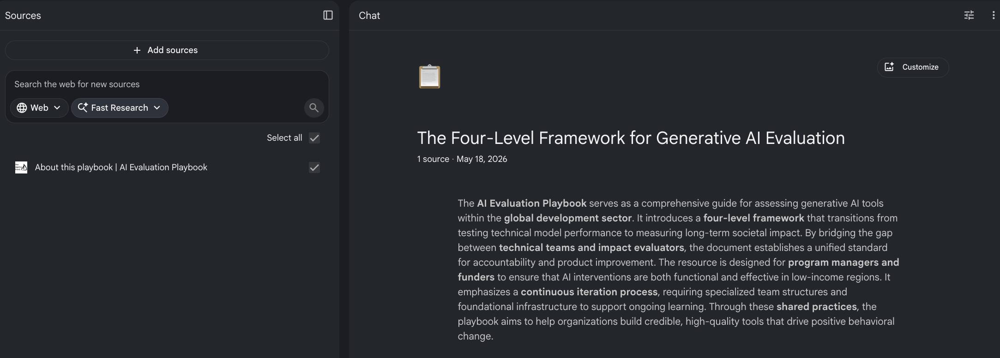

### Using NotebookLM

Start by asking the same question as the previous section:

```
We built a Theory of Change 12 months ago for an AI literacy tutor in rural India. Now we have:

Level 1 accuracy data (87% on golden dataset), Level 2 data (35% week-4 retention, most drop-off at onboarding), and Level 3 data (self-efficacy scores improving but knowledge test scores flat).

Using the framework linkages guidance in the AI Evaluation Playbook, stress-test our Theory of Change against this evidence.

Are we ready for a Level 4 RCT?
```

You can see the response is grounded in the playbook and it cites the specific sections from the playbook that were used to generate the answer.

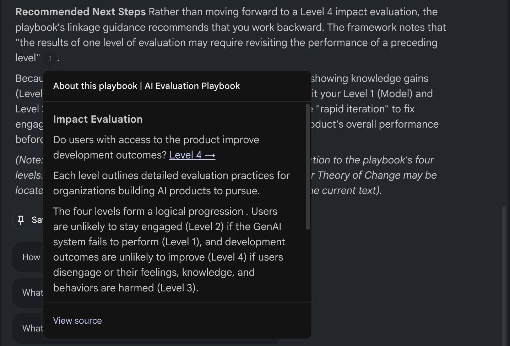

**Things to keep in mind**

* NotebookLM keeps responses strictly within what you've uploaded — it won't draw on outside knowledge. This is great for accuracy, but means it won't combine the framework with other context you haven't added.
* You can add more links and documents as sources beyond the playbook to NotebookLM so that the response takes all the sources into account.

## Gemini Gems

**Best for: Running the same type of task repeatedly, especially if your team already uses Google Workspace (Docs, Sheets, Drive).**

[Gemini Gems](https://gemini.google/overview/gems/) let you create a customized version of Gemini that performs a concrete task with specific instructions and a clear goal repeatedly.

Think of it as a dedicated assistant pre-configured to work with the 4-level framework. You can also connect it to Google docs/sheets/slides, making it useful when you want to apply the framework alongside your own organisation's data and documents.

### Using the playbook with Gemini Gems

Open the `Gems` tab in [Gemini](https://gemini.google.com/) and create a new Gem.

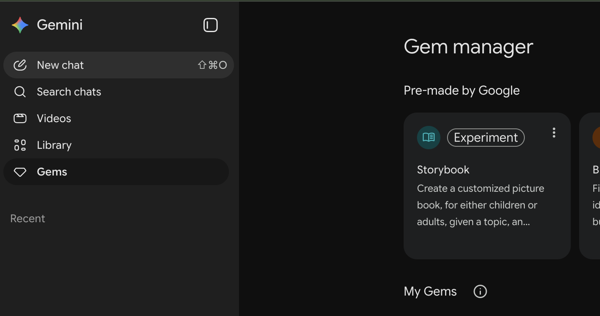

Add a name and description for the Gem along with instructions that explain the task the Gem should perform.

**For example:**

`Name`: Policy Impact Auditor

`Description`: To take raw data or project descriptions and categorize them into the 4-level framework to identify where a policy intervention is succeeding or leaking value

`Instructions`:

```
You are an expert Policy Analyst and Socio-Technical Researcher. Your task is to evaluate AI-driven policy interventions using the 4-Level Evaluation Framework:

Level 1 (Model): Technical performance, accuracy, and bias.

Level 2 (Product): UI/UX, accessibility, and adoption metrics.

Level 3 (User): Behavioral changes, trust, and mental models of the target population.

Level 4 (Impact): Long-term systemic outcomes (economic, health, or social equity).

Your Workflow:

When I provide a project summary, break it down into these four levels.

Identify 'Critical Gaps' (e.g., if a model is 99% accurate but the product is too complex for the target user to navigate).

Suggest 'Policy Levers' for each level to improve the final Impact (Level 4).

Maintain a professional, skeptical, and data-driven tone. Use tables for comparisons.
```

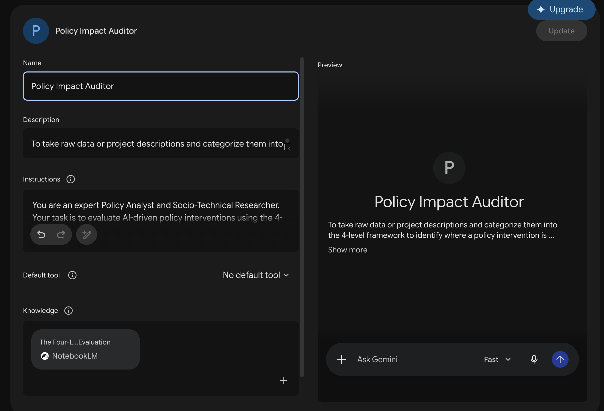

Next, add sources to the Gem. Here, you can add the NotebookLM notebook created above as a source, along with other files from your Google Drive.

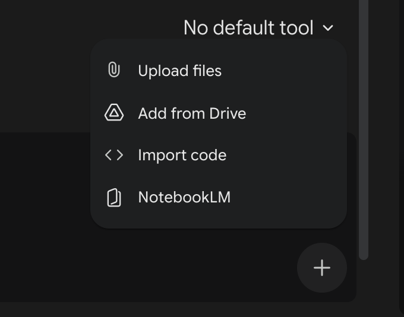

Click `Save`. Your Gem is now ready to use.

### Using the Gem

Try the following prompt:

```
We have deployed an LLM-based SMS chatbot designed to provide real-time agricultural advice to 50,000 farmers to increase national crop yields.

Data for Evaluation:

Technical Performance: The model has a 94% accuracy rate on technical soil science questions in English benchmarks. However, it occasionally hallucinates local seed brand names.

Access & Usage: We have 15,000 active monthly users. Data shows high engagement in urban-adjacent areas, but 0% engagement in the northern "dry-belt" region where 2G connectivity is unstable.

User Feedback: In qualitative interviews, farmers expressed high trust in the AI's "tone," but 40% reported they were confused by the technical jargon used in the advice. 10% of users followed advice that led to minor crop loss due to misinterpreted application rates.

Development Goal: The national policy goal is a 15% increase in maize yield per hectare to ensure food security.
```

Here is a preview of the response:

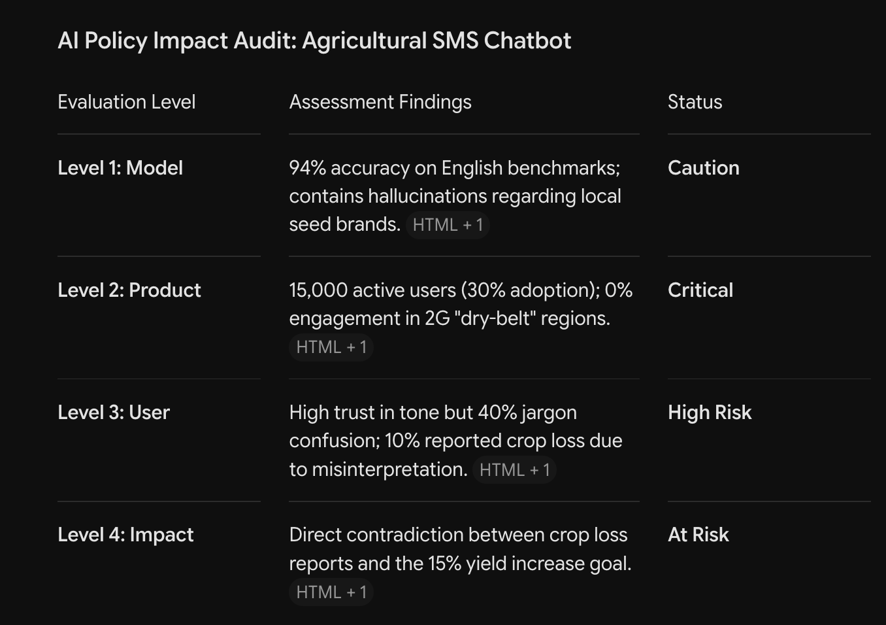

You can see the full response [here](https://gemini.google.com/share/eb1f3e03b45f).

**Things to keep in mind**

* Gems work best for tasks you run regularly — like reviewing an evaluation plan against the framework, or checking whether a set of metrics maps to the right level.
* You can combine the knowledge with tools like deep research, creating images and videos, etc. as shown below.

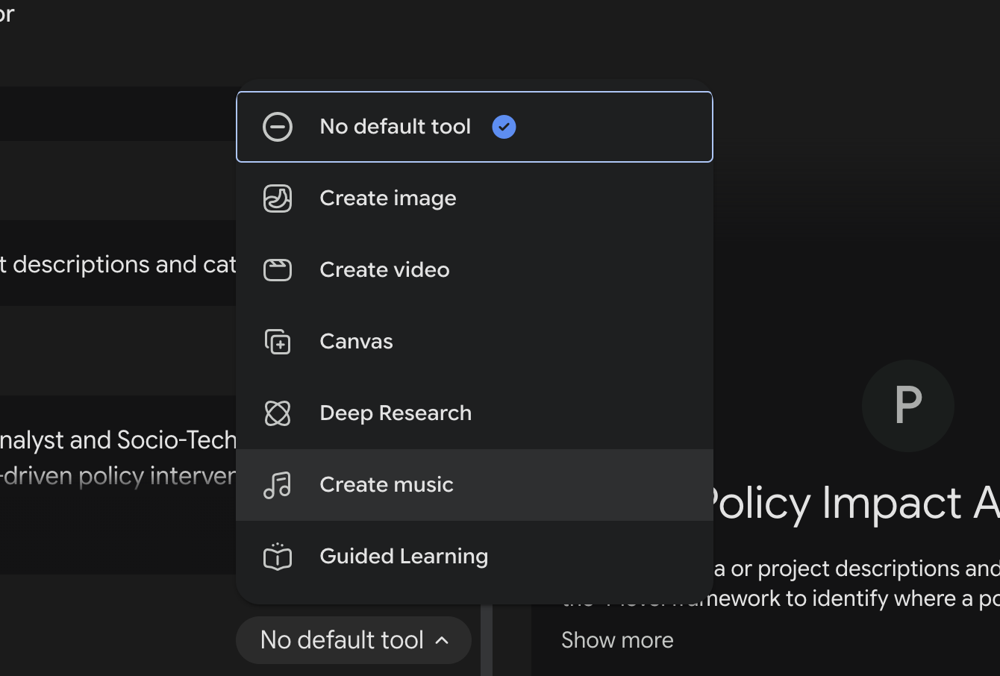

## Paste the playbook content directly

**Best for: Using the playbook with any AI tool — Claude, ChatGPT, Gemini. No setup needed.**

The options mentioned above were specific to the AI tools that support them. Most of them need you to do some setup to use the playbook.

But if you want to get a flavour of how the playbook can instantly help you with the least setup possible, you can paste the playbook content directly into your AI tool of choice.

Every AI tool has a text box you can type or paste into.

Open the full playbook text file by visiting [this URL](https://eval.playbook.org.ai/llms-full.txt) in your browser:

You will see the full playbook content in your browser. Select all the text and copy it.

Open your AI tool of choice and paste the playbook content into the text box. Use any of the example prompts mentioned in the previous options to test it out.

For copying the contents of a single page rather than the whole playbook, you can append `.md` to any page URL (for example: `https://eval.playbook.org.ai/level-3-user-evaluation/overview/why-is-this-level-of-evaluation-important.md`).

**Things to keep in mind**

* This works in any AI tool and no other setup is required. The entire playbook text is around 45,000 words. Most modern AI tools can handle this, but very long pastes may slow down responses or exhaust the token limit of your plan.
* You need to paste it fresh every new conversation. Once the value of the playbook is clear to you, switch to one of the options above so that you don't have to keep pasting the playbook content every time.

***

## MCP server

**Not recommended for most users. Using the skills file is a better option.**

MCP (Model Context Protocol) is a way to connect Claude to external resources so it can look things up during a conversation without you needing to paste anything.

You need to add the playbook as a connector, and then Claude will pull in the relevant sections automatically whenever you ask evaluation-related questions.

You can practically achieve the same result using the skills file but with a more complicated setup.

Follow the steps [here](https://support.claude.com/en/articles/11175166-get-started-with-custom-connectors-using-remote-mcp) on how to add a connector. Use `https://eval.playbook.org.ai/~gitbook/mcp` as the MCP server URL.

Once connected, use any of the example prompts mentioned in the previous options to test it out.

## Which option is right for you?

If you're not sure where to start, **NotebookLM** is the easiest way to explore the playbook interactively. Once you're comfortable, **Claude Skills** is recommended for regular Claude users and **Gemini Gems** are recommended for Google Workspace users who want to run the same task repeatedly. **Paste the playbook content directly** is a good option for any AI tool and no other setup is required.

## Example use cases by role

To help you understand how the playbook can be used in practice, we have provided some example use cases for different roles in a team where the playbook can help you in your work. These are not exhaustive, but should give you an idea of how the playbook can be used in practice.

### Impact Evaluator

_Designs RCTs and quasi-experimental studies, manages counterfactual selection, and connects Level 1–3 evidence to long-term outcomes. Leads Level 4._

**Example 1 — Drafting an RCT pre-analysis plan**

> You're pre-registering a Level 4 RCT for an AI agricultural advisory tool. You need a pre-analysis plan that handles the unique challenges of evaluating a product that will change during the trial.

**Try this prompt:**

> I'm pre-registering a cluster-randomised RCT to evaluate an AI agricultural advisory tool for 800 maize farmers across 40 villages in Ethiopia. Primary outcome: crop yield at harvest. The product will likely update 2–3 times during the 8-month trial.
>
> Using the Level 4 guidance in the AI Evaluation Playbook, draft the key sections of a pre-analysis plan. Include: counterfactual justification, how product versions will be tagged and handled analytically, spillover mitigation strategy (the tool is on WhatsApp and can be shared), power calculation assumptions, primary and secondary outcomes, and pre-specified subgroup analyses by gender and land size. Flag the top 3 AI-specific pitfalls to address.

**What you'll get:** A structured pre-analysis plan with AI-specific versioning and spillover sections — ready for pre-registration.

***

**Example 2 — Stress-testing a Theory of Change**

> Your Theory of Change was written 12 months ago. Level 1–3 data is now available. You need to check whether the causal chain still holds before committing to a Level 4 study.

**Try this prompt:**

> We built a Theory of Change 12 months ago for an AI literacy tutor in rural India. Now we have: Level 1 accuracy data (87% on golden dataset), Level 2 data (35% week-4 retention, most drop-off at onboarding), and Level 3 data (self-efficacy scores improving but knowledge test scores flat).
>
> Using the framework linkages guidance in the AI Evaluation Playbook, stress-test our Theory of Change against this evidence. Identify which causal links are supported, which are broken or uncertain, what the flat knowledge scores imply about our proximal outcome assumptions, whether we are ready for a Level 4 RCT or should iterate further, and what process evaluation questions to answer first. Output this as a structured memo I can share with our funder.

**What you'll get:** A structured memo identifying which causal links hold and which don't — with a clear recommendation on whether to proceed to Level 4 or iterate first.

### Domain Expert

_Validates rubrics, golden datasets, metric definitions, and Theory of Change assumptions across health, education, or agriculture domains. Supports all levels._

**Example 1 — Critiquing a rubric from a clinical perspective**

> The engineering team has drafted a Level 1 rubric for a clinical decision support tool. As a nurse supervisor, you need to validate it before the golden dataset sprint.

**Try this prompt:**

> I'm a nurse supervisor reviewing a Level 1 evaluation rubric drafted by engineers for an AI clinical decision support tool used by community health workers in Uganda. The rubric has 5 dimensions: medical accuracy, response completeness, safety, tone, and latency.
>
> Help me critique this rubric from a clinical domain expert perspective, following the AI Evaluation Playbook's guidance on rubric validation. For each dimension: flag what the engineers likely missed from a clinical workflow standpoint, suggest a concrete real-world failure case that the current definition would miss, and propose a sharper domain-specific definition. Then suggest one additional dimension the engineers have overlooked entirely.

**What you'll get:** A detailed critique with dimension-by-dimension gaps, real failure cases, sharper definitions, and a missing dimension — ready to return to the engineering team.

***

**Example 2 — Annotating a Theory of Change**

> You're reviewing a Theory of Change for an AI advisory tool for smallholder farmers in Northern Ghana. The causal chain looks clean on paper — your job is to find where it breaks in the field.

**Try this prompt:**

> I'm a domain expert reviewing a Theory of Change for an AI advisory tool for smallholder farmers in Northern Ghana. The ToC assumes: farmers receive AI crop advice → act on advice within 48 hours → improve crop management → increase yields.
>
> Using the Theory of Change guidance from the AI Evaluation Playbook, help me identify the weakest assumptions from a field implementation perspective. For each weak link: explain the real-world constraint that breaks the assumption (e.g. input availability, weather, land tenure), suggest a Level 2 or Level 3 metric that would detect when this link is failing, and recommend a process evaluation method to investigate it. Format this as annotated ToC review notes I can return to the research team.

**What you'll get:** Annotated ToC notes with field-grounded constraints, early-warning metrics, and process evaluation methods — ready to send back to the research team.

### Policy Analyst

_Works in government, multilaterals, or think tanks. Interprets evaluation findings, assesses whether a tool is ready to scale, and translates technical evidence into recommendations for decision-makers._

**Example 1 — Writing a policy brief from evaluation data**

> Your ministry is deciding whether to integrate an AI agricultural advisory tool into the national extension service for 2 million smallholder farmers. You have technical evaluation reports and need a 2-page brief for the Secretary.

**Try this prompt:**

> I'm a policy analyst at a ministry of agriculture. We're evaluating whether to integrate an AI advisory chatbot into the national extension service. I have the following evaluation summary: Level 1 accuracy 89% overall but 74% word error rate in Amharic; Level 2 week-4 retention 52%, with heavy urban/rural split; Level 3 self-efficacy scores up 0.4 SD after 8 weeks, knowledge test scores flat, 12% of users show AI dependency signals.
>
> Using the AI Evaluation Playbook's 4-level framework, help me interpret this evidence for a non-technical Secretary-level audience. Structure your response as: (1) a plain-language verdict on each level — what it means in practice, not what the number is; (2) the 2 biggest risks of scaling now versus waiting; (3) the 3 conditions the implementer must meet before national rollout; and (4) a one-paragraph executive summary I can put at the top of the brief.

**What you'll get:** A structured brief with plain-language verdicts, risk analysis, scale conditions, and a one-paragraph executive summary — ready to hand to the Secretary.

***

**Example 2 — Comparing two competing interventions**

> Two AI tools are competing for the same budget. You need to compare them not by their marketing claims, but by the strength of their evidence chains.

**Try this prompt:**

> I need to compare two AI interventions competing for the same funding:
>
> Option A — AI maternal health chatbot: Level 1 accuracy 91%, Level 2 week-4 retention 61%, Level 3 showing reduced anxiety (effect size 0.3 SD), no Level 4 evidence yet. Cost per user: $4.
>
> Option B — AI teacher coaching tool: Level 1 accuracy 78%, Level 2 week-4 retention 44%, Level 3 knowledge gains 0.5 SD but self-efficacy flat, one Level 4 RCT in progress (results in 9 months). Cost per user: $11.
>
> Using the AI Evaluation Playbook's evidence strength framework across all four levels, help me structure a comparison. For each option: assess the strength and gaps in the evidence chain, flag what is missing before a scaling decision is justified, estimate the relative risk of a premature scale-up, and suggest what interim condition or milestone should be attached to any funding decision.

**What you'll get:** A structured comparison that reads the evidence pattern — not just the numbers — and surfaces what each product still needs to prove before it earns a scaling decision.

### Funding Reviewer

_Works at a foundation, bilateral donor, or multilateral. Reviews grant proposals for GenAI projects, assesses whether proposed evaluation plans are rigorous enough, and sets evaluation conditions for funding._

**Example 1 — Reviewing a proposal's evaluation plan**

> A promising NGO has submitted a $2M proposal for an AI literacy tutor. Their evaluation section is 3 paragraphs. You need a structured critique before the investment committee meeting.

**Try this prompt:**

> I'm reviewing a $2M grant proposal for an AI literacy tutor targeting out-of-school girls aged 10–14 in rural Pakistan. The applicant's entire evaluation plan reads: "We will track user satisfaction surveys and engagement analytics, aiming for 80% satisfaction and 70% weekly active users by month 6. A third-party evaluation will be commissioned in year 2."
>
> Using the AI Evaluation Playbook's Minimum Viable Evaluation checklists for all four levels, score this evaluation plan against what the playbook considers the minimum bar for each level. For each level: state whether the plan meets, partially meets, or fails to meet the MVE standard, explain the specific gap, and write 1–2 specific questions I should ask the applicant in the clarification call. Then give an overall readiness verdict: fund as-is, fund with conditions, request a resubmission, or decline. Include the 3 non-negotiable conditions I would attach to any funding decision.

**What you'll get:** A level-by-level gap analysis mapped to the MVE checklists, specific clarification questions, and a funding verdict with non-negotiable conditions — reviewable by your investment committee.

***

**Example 2 — Setting evaluation requirements for an RFP**

> Your foundation is launching a $10M RFP for GenAI tools in primary healthcare. You need evaluation requirements that are rigorous but won't exclude smaller organisations.

**Try this prompt:**

> I'm designing evaluation requirements for a $10M RFP for GenAI tools in primary healthcare across Sub-Saharan Africa. Applicants will range from small local NGOs to established international organisations. We want rigorous evaluation without creating requirements so burdensome that only large organisations with research departments can apply.
>
> Using the AI Evaluation Playbook's Minimum Viable Evaluation framework and tiered approach, help me design a two-tier evaluation requirement: a baseline tier all applicants must meet, and an enhanced tier for applicants requesting over $500K. For each tier and each of the 4 evaluation levels, specify the minimum required activities, the evidence format you'd accept, and the red lines that would disqualify a proposal regardless of tier.

**What you'll get:** A two-tier evaluation framework with per-level requirements, accepted evidence formats, and disqualifying red lines — ready to paste into your RFP.

### AI / ML Engineer

_Builds and maintains the AI pipeline, evaluation rubrics, golden datasets, and automated scoring. Primarily works at Level 1 but feeds into Levels 2–4._

**Example 1 — Drafting an evaluation rubric**

> You're building an agricultural advisory chatbot for smallholder farmers in Kenya. You need a Level 1 rubric before writing a single golden dataset entry.

**Try this prompt:**

> I'm building a RAG-based agricultural chatbot for smallholder farmers in Kenya. It answers questions about crop disease, planting schedules, and input sourcing via WhatsApp in Swahili and English.
>
> Using the evaluation rubric guidance from the AI Evaluation Playbook (Level 1), help me draft a 5-dimension rubric. For each dimension include: the qualitative definition, a concrete example of a passing and failing response, and a suggested scorer type (statistical, model-based, or LLM-as-judge).

**What you'll get:** A structured rubric with pass/fail examples and scorer recommendations — ready to hand to your team before the dataset sprint begins.

***

**Example 2 — Seeding a golden dataset**

> Your domain expert has 2 hours. You need to get maximum value from that session by pre-drafting diverse golden dataset entries for their review.

**Try this prompt:**

> I have 2 hours with an agronomist before my golden dataset sprint. My chatbot handles crop disease, planting advice, and input sourcing for maize farmers in Western Kenya.
>
> Generate 15 draft golden dataset entries covering: typical user queries in varying formality and Swahili-English code-switching, out-of-scope requests, and adversarial/safety edge cases. For each entry provide: user input, ideal output structure, and which rubric dimension it primarily tests. Flag the 3 entries most critical for the expert to validate first.

**What you'll get:** A diverse draft dataset that makes the expert session far more productive — with the highest-risk entries flagged for priority review.

### Product Manager

_Owns product metrics, the user funnel, A/B test design, and translating evaluation insights into the roadmap. Primarily works at Level 2._

**Example 1 — Designing a user funnel**

> You're launching a maternal health WhatsApp chatbot for expectant mothers in Nigeria. You need a user funnel with metrics before your engineering sprint.

**Try this prompt:**

> We're launching a maternal health chatbot on WhatsApp for expectant mothers in Nigeria. Our theory of change: mothers receive timely health information → increase antenatal care visits → reduce maternal mortality.
>
> Using the user funnel framework from the AI Evaluation Playbook (Level 2), design a complete funnel from Acquisition to Development Outcome. For each funnel stage: define the metric, explain how to measure it in a WhatsApp context, and identify the leading indicator that predicts the next stage.

**What you'll get:** A complete funnel with stage-by-stage metrics, measurement methods, and leading indicators — ready for your engineering sprint planning.

***

**Example 2 — Writing an A/B test plan**

> Retention drops after week 2. You suspect the onboarding tone is too clinical. You need a clean hypothesis and test design before the next sprint.

**Try this prompt:**

> Our maternal health chatbot has a 40% week-2 retention drop. Level 2 data shows users engage heavily in week 1 but disengage after the first prenatal reminder message.
>
> Help me write an A/B test plan following the experimentation guidance in the AI Evaluation Playbook. Include: the specific hypothesis, treatment vs control variants, primary and secondary metrics, minimum detectable effect, guardrail metrics to monitor, and a pre-analysis plan summary. Then list 3 alternative hypotheses I should rule out first via process evaluation.

**What you'll get:** A rigorous test plan with a clear hypothesis, MDE calculation, and a checklist of things to investigate before running the experiment.

### Data Scientist

_Builds ETL pipelines, defines metric schemas, runs A/B analysis, and connects data across evaluation levels._

**Example 1 — Designing a data schema across all four levels**

> You need to design a data warehouse schema that links model traces, product events, and survey responses across all four evaluation levels.

**Try this prompt:**

> I'm building the data infrastructure for a digital agriculture platform serving 50,000 farmers. We collect: LLM trace logs (Level 1), WhatsApp engagement events (Level 2), quarterly SMS surveys (Level 3), and annual yield data from partner NGOs (Level 4).
>
> Using the ETL pipeline guidance from the AI Evaluation Playbook, propose a data warehouse schema that links all four levels. Include: table structures, key joins, and how to handle data that arrives at different frequencies. Flag the 3 most common pipeline failures in this kind of multi-level setup.

**What you'll get:** A multi-level schema design with join logic, data frequency handling, and a practical failure checklist.

***

**Example 2 — Building a surrogate index**

> Your Level 4 RCT is 18 months away. You need a surrogate index from Level 2–3 data to run faster product iterations now.

**Try this prompt:**

> We're 18 months from our Level 4 RCT measuring smallholder farmer income gains. We have 6 months of Level 2 data (session depth, feature uptake) and Level 3 data (self-efficacy surveys, question complexity scores).
>
> Following the Surrogate Index framework in the AI Evaluation Playbook, help me construct a surrogate index. Suggest which Level 2–3 metrics to include, how to weight them based on theoretical proximity to income outcomes, how to validate the index against any available Level 4 pilot data, and what the assumptions and limitations are. Output this as a draft methods note I can share with our impact evaluator.

**What you'll get:** A surrogate index design with weightings, validation approach, and a methods note — ready to share with your impact evaluation partner.

### User Researcher

_Measures cognitive, affective, and behavioural outcomes. Runs surveys, interviews, and NLP analysis on conversation logs. Primarily works at Level 3._

**Example 1 — Designing an in-chat survey**

> You need a 3-question in-chat survey to measure self-efficacy and knowledge gain after a tutoring session, without disrupting the conversation flow.

**Try this prompt:**

> I'm evaluating an AI math tutoring chatbot for secondary school students in Ghana. I want to measure self-efficacy and immediate knowledge gain after each session, embedded naturally in the WhatsApp conversation.
>
> Using the survey guidance from the AI Evaluation Playbook (Level 3), design a 3-item in-chat survey. For each item: write the question in natural conversational language, specify the response format (e.g. 1–5 scale, yes/no, open text), explain what construct it measures and why, and flag any cultural adaptation considerations for a West African student population.

**What you'll get:** A 3-item survey with conversational wording, validated constructs, and cultural adaptation notes — ready to embed in your chatbot flow.

***

**Example 2 — Analysing conversation logs at scale**

> You have 500 conversation logs from a health chatbot. You need to extract cognitive and affective signals at scale without reading every log.

**Try this prompt:**

> I have 500 conversation logs from a postpartum mental health chatbot deployed in South Africa. I need to extract Level 3 signals at scale without manually reading each log.
>
> Based on the NLP analysis methods in the AI Evaluation Playbook (Level 3), design an analysis pipeline. Specify: which sentiment and linguistic signals to extract and why, the appropriate NLP method for each signal (LIWC, LLM-as-judge, topic modelling), a sample LLM-as-judge prompt for scoring 'perceived empathy' from a conversation excerpt, and guardrail checks to detect AI dependency patterns.

**What you'll get:** A scalable analysis pipeline with method-to-signal mappings, a ready-to-use judge prompt, and dependency detection checks.

***

<details>

<summary>💬 Want to suggest edits or provide feedback?</summary>

{% embed url="https://tally.so/r/A788l0?originPage=references%2Fusing-the-playbook-with-ai-tools" %}

</details>
