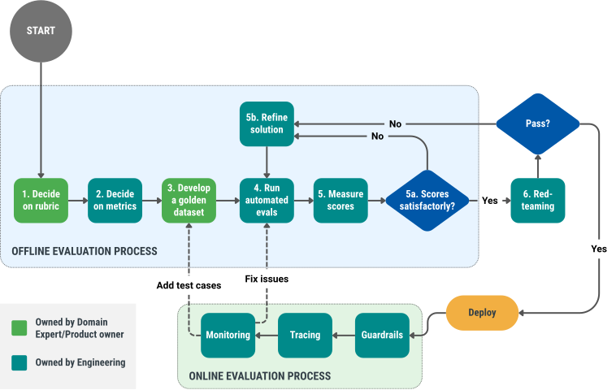

---
layout:
  width: default
  title:
    visible: true
  description:
    visible: true
  tableOfContents:
    visible: true
  outline:
    visible: false
  pagination:
    visible: true
  metadata:
    visible: true
  tags:
    visible: true
metaLinks:
  alternates:
    - >-
      https://app.gitbook.com/s/pbloAUUbQhacfW14WRJm/level-1-model-evaluation/how-is-level-1-evaluation-performed
---

# How is Level 1 evaluation performed?

End-to-end, the entire Level 1 evaluation workflow is both complex and highly iterative (see Figure 7). However, we encourage you to start with a [Minimum Viable Evaluation](https://app.gitbook.com/s/Ec5nQAw37GGYw1m7rYdO/additional-resources/minimum-viable-evaluations), and build incrementally as the product matures.

<figure><figcaption>
Figure 7: Level 1 Evals Workflow
</figcaption></figure>

### 6-step process for evaluating AI systems. 

We will elaborate on each of these steps in turn. You can apply this process to each of the non-deterministic models in your AI system, individually at first (if needed) but eventually as an ensemble:



#### [Decide on an evaluation rubric](1.-decide-on-an-evaluation-rubric.md)

The first step in Level 1 evals is to come up with your evaluation rubric.



#### [Decide on metrics](2.-decide-on-metrics.md)

Once you have defined a rubric, the next step is to define metrics you will use to track performance along each dimension in the rubric.



#### [Develop a golden dataset](3.-develop-a-golden-dataset.md)

To verify if your solution is actually improving along the rubric’s dimensions, you need a Golden Dataset: a set of records representing an optimal or ideal user interaction with the system.



#### [Scoring & error analysis](4.-scoring-and-error-analysis.md)

Run online and offline evaluations and conduct error analysis



#### [Automate your evaluations](5.-automate-your-evaluations.md)

Manual evaluation can become tedious, is not scalable, and introduces inconsistency. We recommend gradually automating the process and integrating it directly into your engineering team's workflow.



#### [Red-teaming](6.-red-teaming.md)

Beyond evaluating your solution against known criteria (e.g. those captured in your Golden Dataset), you may also want to actively try to break or pressure test your AI system before releasing it into the wild.



***

💬 Want to suggest edits or provide feedback?

{% embed url="https://tally.so/r/A788l0?originPage=level-1-model-evaluation%2Fhow-is-level-1-evaluation-performed" %}

