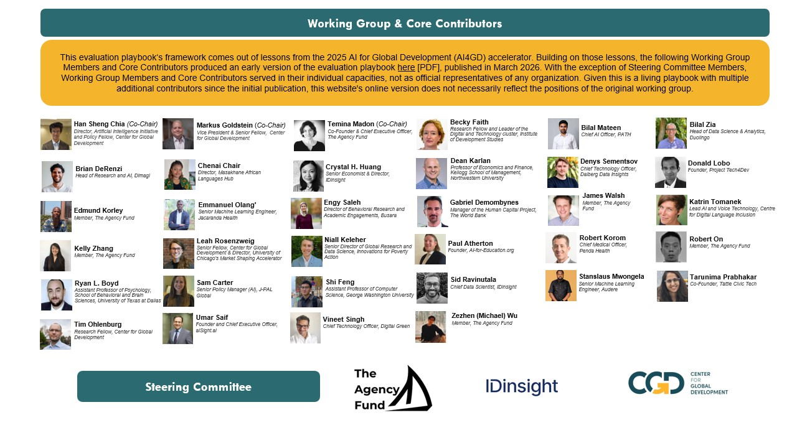

# Acknowledgements

This evaluation framework draws on real-world lessons from the [AI for Global Development (AI4GD) accelerator](https://www.google.com/url?q=https://agencyfund.notion.site/ai-for-global-development\&sa=D\&source=editors\&ust=1770879886860496\&usg=AOvVaw1AlYMdsaDITkRShep5YPxB). In 2025, the Accelerator—led by [The Agency Fund](https://www.google.com/url?q=https://www.agency.fund/\&sa=D\&source=editors\&ust=1770879886860734\&usg=AOvVaw0wK2YFIp5wTp6pKQPEv8MK) (TAF) in collaboration with [OpenAI](https://www.google.com/url?q=https://openai.com/\&sa=D\&source=editors\&ust=1770879886860869\&usg=AOvVaw3m5Yxp8U6Z9bE21S9xGEwm) and experts at the [Center for Global Development](https://www.google.com/url?q=https://www.cgdev.org/\&sa=D\&source=editors\&ust=1770879886861022\&usg=AOvVaw3uUFG80_jXyXdjkYLS9Lbx)(CGD)—invested $5 million in eight non-profits building GenAI products and services across education, health, and agricultural livelihoods. CGD then convened a Technical Working Group to refine the initial framework into this living playbook, incorporating lessons from organizations and practitioners at the forefront of evaluating GenAI for the development sector.

The core authors are&#x20;

* Level 1: Sid Ravinutala, IDinsight
* Level 2: Robert On, The Agency Fund
* Level 3: Temina Madon, The Agency Fund
* Level 4: Markus Goldstein, Center for Global Development

<figure><figcaption></figcaption></figure>
