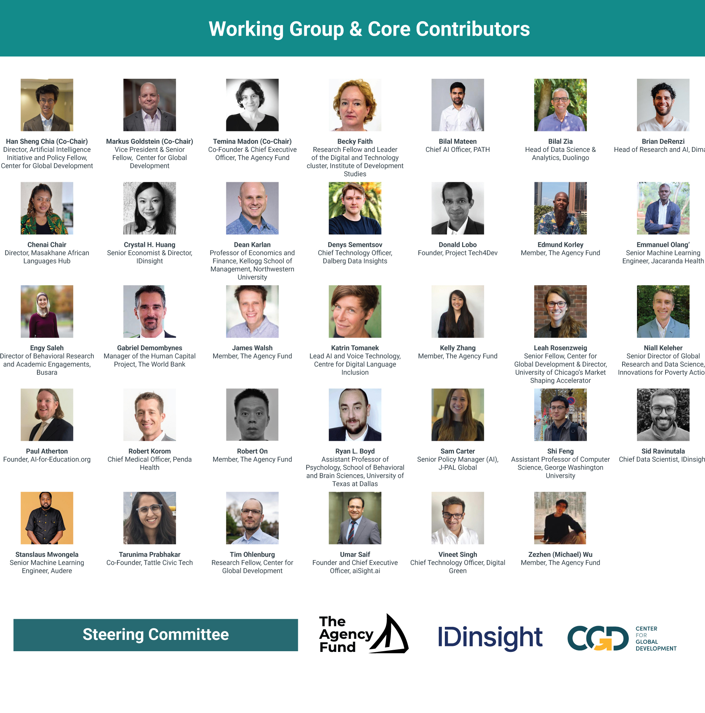
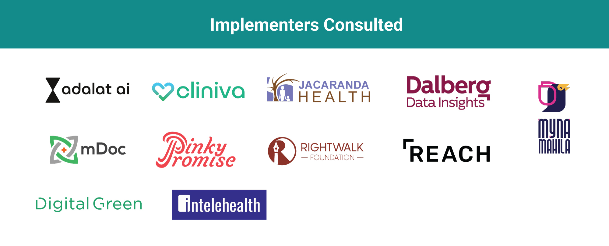

# The Process Behind This Playbook

This playbook draws on real-world evaluation practices developed during the 2025 [AI for Global Development (AI4GD) accelerator](https://agencyfund.notion.site/ai-for-global-development). The Accelerator—led by The Agency Fund (TAF) in collaboration with OpenAI and experts at the Center for Global Development (CGD)—invested $5 million in eight non-profits building GenAI products and services across education, health, and agricultural livelihoods.

CGD convened a Technical Working Group to refine these evaluation lessons into this living playbook. The group included more than 30 experts across computer science, economics, gender studies, health, education, and agriculture, with representation from Asia, Africa, North America, and Europe. IDinsight also interviewed non-profits building or deploying generative AI in the social sector to understand their current evaluation approaches and what guidance they find most actionable. More than 300 comments from experts and nonprofits informed the next version of the playbook. The convening and development of this Playbook was funded by the Gates Foundation.

The Playbook is now a living document with a development roadmap that will evolve as evidence and AI capabilities advance, with TAF, IDinsight, and CGD stewarding updates and incorporating community feedback. 

<figure><figcaption></figcaption></figure>


Note: The version Working Group Members first published in March 2026 can be found here \[PDF]. Given this is a living playbook with multiple additional contributors since the initial publication, this website's online version does not necessarily reflect the positions of the original working group.​ With the exception of Steering Committee Members, Working Group Members and Core Contributors served in their individual capacities, not as official representatives of any organization.


<figure><figcaption></figcaption></figure>

### Community of Contributors



Asim Fayaz, The Agency Fund

Aman Dalmia, The Agency Fund

Isha Fuletra, IDinsight



Suzin You, IDinsight

Yolanda Yang, CGD



***

💬 Want to suggest edits or provide feedback?

{% embed url="https://tally.so/r/A788l0?originPage=references%2Fthe-process-behind-this-playbook" %}

