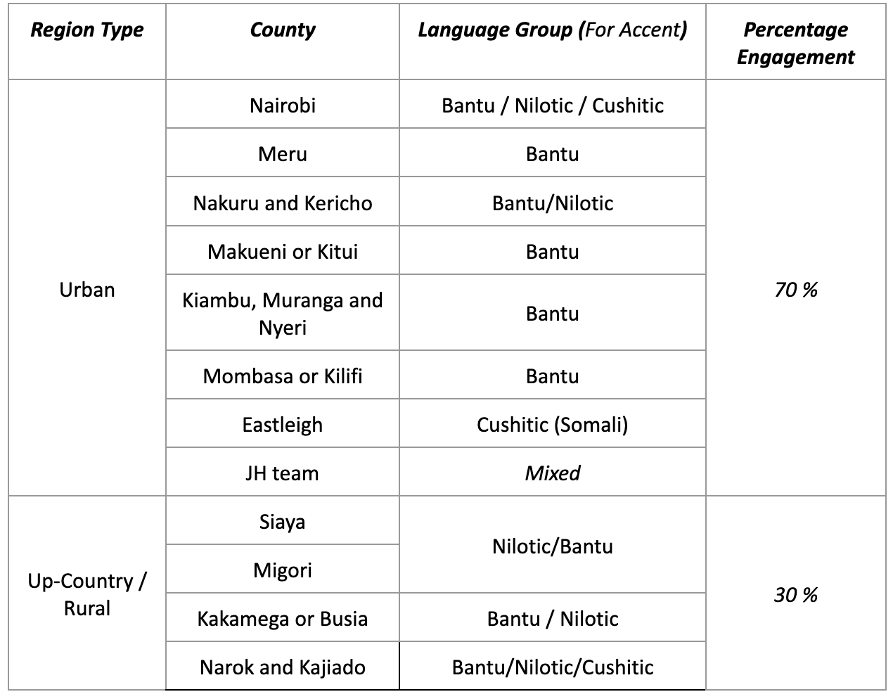

# Level 1 – Model evaluation

## Why is this level of evaluation important?

Level 1 evaluations focus on the AI system (see figure 6 below) that form the “smarts” of your product. And while these AI systems are powerful, they have inherent blind spots. Large language models (LLMs) like GPT, Claude and Gemini do not [understand](https://www.google.com/url?q=https://www.sciencenews.org/article/ai-large-language-model-understanding?utm_source%3Dchatgpt.com\&sa=D\&source=editors\&ust=1770879886919367\&usg=AOvVaw2IuQUzdG6HVftGYlMDjGer) content in the way humans do. Given an input, they generate output by predicting the next word in a sequence. Their predictions mimic the data used in model training—usually a vast collection of information published to the internet, including textbooks and computer code, as well as misinformation, unverified claims, and conspiracy theories. This is why they can appear fluent and convincing while remaining inaccurate, irrelevant, or harmful—a phenomenon known as hallucination.

Because of the way they are trained, AI models face several limitations:

<table data-card-size="large" data-view="cards"><thead><tr><th></th><th></th></tr></thead><tbody><tr><td><strong>Static Knowledge</strong></td><td>Used alone, they cannot access real-time information (e.g., current weather in a rural village) so are limited to the training data they have received.</td></tr><tr><td><strong>Limited Context</strong></td><td>The model will not have access to personal information or your proprietary documents unless explicitly engineered to do so. As a result, models may lack the context to generate actionable, personalized, or even accurate outputs for a given task.</td></tr><tr><td><strong>Instruction Following</strong></td><td>Models may struggle to adhere to complex instructions or fail to follow constraints consistently, leading to results that do not fully meet expected criteria.</td></tr><tr><td><strong>Task Mismatch</strong></td><td>AI models are not the right “tool” for every task; for example, they may confidently make errors in math calculations which are trivial for a calculator. Understanding where they shine and augmenting them with capabilities they lack is key to using them well.</td></tr></tbody></table>

Product developers can often address these limitations, but it requires a structured, continuous evaluation process: a set of iterative workflows to verify that the AI system is useful, accurate, and safe; and that it reliably exhibits desirable behaviors and characteristics. For instance, an effective AI tutor will follow pedagogical best practices – like withholding answers to encourage self-directed learning, or gauging a student’s abilities to better tailor instruction.

Level 1 evaluation verifies that the AI system performs reliably and is appropriate to the context. This is non-negotiable in sectors like education, health, and agriculture, where misalignment or unverified claims can cause real-world harm to vulnerable users. We recommend starting early with Level 1 evaluation, to prevent wasted effort and time.

You can begin by engaging key stakeholders, including users and domain experts, to define success criteria and a continuous evaluation strategy. This allows you to shape system behavior throughout the development process, and to avoid the high costs (and delays) of fixing a misaligned system after it has already been built.

## What is the “AI system” being evaluated?

In this playbook, we will distinguish between two different concepts:

**Foundation Model (The "Nucleus")**: This is a large-scale model, trained on vast datasets, used as part of an overall system. Examples: GPT-5, Claude Opus 4.5, Gemini 3

**End-to-End AI System (The "Cell")**: This is the entire AI workflow or system that you build. It incorporates one or more foundation models, plus all the other components that make the pipeline work for a user. Just as a cell contains a nucleus, mitochondria (for energy) and a cell wall, your full pipeline will include multiple components, like:

* Knowledge bases containing specific information for retrieval
* Instructions for the AI model (“system prompt”) and safety guardrails, like content filters
* Language translation, speech-to-text/text-to-speech transformations, and other processing steps
* Tools that let the model take actions like sending an email or performing web search

When we say “AI system”, we generally are referring to the End-to-End AI System described above. To avoid confusion, we will always use the term foundation model when referring to the “nucleus” and use “AI system” or “AI pipeline” when referring to the “cell”.

.png>)

[editable version](https://www.google.com/url?q=https://excalidraw.com/%23json%3DOl8z3Va5lh7GnOXuMcLQA,xIxG6aHn8Pz9xFusGOLFtg\&sa=D\&source=editors\&ust=1770879886926964\&usg=AOvVaw24dLSf36D-1keWrz4QBraF)

To simplify the evaluation of an AI system, we define three distinct components:

1. **Pre-processing**: Before a user input hits the foundation model, it is transformed into a suitable format. Common steps include:
   * Sanitization: Rejecting unsafe or irrelevant inputs
   * Conversion: Turning speech into text (e.g. using an automatic speech recognition model)
   * Refinement: Paraphrasing the request (e.g. converting a vague message to more specific based on the conversation history) or translating it from a low-resource language to a high-resource one (since LLMs perform better in high-resource languages)
2. **LLM Context Preparation**: Beyond the user’s pre-processed request, a foundation model requires the following additional components to function:
   * The “system prompt”: These instructions guide the foundation model’s behavior.
   * External Tools: These augment the foundation model by letting it take actions (e.g. web search)
   * Context: Relevant background, such as conversation history, data retrieved from a knowledge base, or responses received from calling tools (e.g. web search results).
3. **Post-processing**: Before the output reaches the user, it undergoes final checks and transformations. Common steps include:
   * Quality Control: Checking for hallucinations (e.g. by ensuring the response is always grounded in the knowledge base) and verifying safety guardrails as defined by you
   * Formatting: Converting text to speech or translating the answer back into the user’s preferred language.

Level 1 evaluations should cover this entire pipeline. They assess your complete AI system, from the user's input to the final output, verifying that each piece of the pipeline exhibits desirable behaviors. You can (and should) test individual components of this workflow using unit tests. Note that others have written at length on the topic of [unit testing](#user-content-fn-1)[^1], and it is not covered here in detail.

Remember that AI solutions can take many forms. They can be chatbots, voice bots for real-time conversation, or agents that take actions, like filling out our forms or calling external services. Level 1 evaluations cover all these modalities.

### Example: an AI agronomist deployed in Senegal

Consider a product answering questions from farmers in Pulaar. The AI system includes the three components as follows:

<table><thead><tr><th width="203.69140625">Component</th><th>Workflow Steps</th></tr></thead><tbody><tr><td>Pre-processing</td><td><ul><li>Check input for malicious or off-topic content (filtering model)</li><li>Translate query from Pulaar to English (translation model)</li></ul></td></tr><tr><td>Context Preparation</td><td><ul><li>Retrieve relevant agricultural content from the database</li><li>Retrieve specific information about the farmer from the context window</li><li>Generate response to processed user input (large language model)</li></ul></td></tr><tr><td>Post-processing</td><td><ul><li>Verify the answer is grounded in the content provided in your knowledge base</li><li>Translate the response back to Pulaa (translation model)</li></ul></td></tr></tbody></table>

### Low vs high-resource languages

Most LLMs are trained on digitized text in just a handful of languages, predominantly English. Yet they are used in contexts where users speak ”low-resource” languages, such as Kannada or Hikuyu. These languages may be spoken by tens of millions of people, but there is relatively less digitized text (and even fewer labeled datasets) available to train foundation models. As a result, LLM queries in these languages may result in higher rates of hallucination or other failure modes. In contrast, “high-resource” languages like English or Hindi have far more internet and digital data available, leading to stronger performance. To improve the performance of an AI system operating in “low-resource” languages, you may want to design your systems to first translate the user’s input from their language to a high-resource one, generate the AI response in a high-resource foundation model, then translate the answer back, so the user receives guidance in the language they prefer.

## How is Level 1 evaluation performed?

Here we describe a 6-step process for evaluating AI systems. We will elaborate on each of these steps in turn. You can apply this process to each of the non-deterministic models in your AI system, individually at first (if needed) but eventually as an ensemble:

### 1. Decide on an evaluation rubric

The first step in Level 1 evals is to come up with your evaluation rubric. Working with domain experts and other stakeholders, you will define the characteristics that your AI solution must exhibit, in the form of targets or success criteria. For example, an AI agronomist might prioritize the “accuracy” of scientific information presented, and a mental health bot might need to emphasize “empathy”.

While some evaluation criteria are common, the majority of your rubric will be driven by your specific use case. To ensure a comprehensive evaluation, your rubric should explicitly address these five dimensions:

<table data-full-width="true"><thead><tr><th width="132.9609375">Dimension</th><th>What to Measure</th><th>Target</th></tr></thead><tbody><tr><td>Accuracy/ Usefulness</td><td>The quality of the AI’s response and whether it sufficiently addresses the task at hand</td><td>“The response must address the user’s specific question instead of giving a generic answer and it must be medically accurate.”</td></tr><tr><td>Qualitative / Branding</td><td>The "personality" and tone of the AI.</td><td>"The response must be professional and never use jargon."</td></tr><tr><td>Safety &#x26; Sensitivity</td><td>Identifying sensitive issues specific to your use case and specify any unacceptable behaviours.</td><td>"The AI system must never provide legal advice or comment on [Sensitive Topic X]."</td></tr><tr><td>Robustness &#x26; Stability</td><td>The system's ability to remain consistent when the same question is asked in different ways.</td><td>"The core answer should not change if the user uses different phrasing or synonyms."</td></tr><tr><td>Linguistic Consistency</td><td>For multi-language apps, ensuring performance doesn't drop across languages.</td><td>"The Swahili and Sheng question must receive the same level of detail as the English version."</td></tr><tr><td>Service-Level Performance</td><td>The "cost of doing business."</td><td>"The end-to-end response time must be less than 2 seconds at a cost of &#x3C;$0.01 per query."</td></tr></tbody></table>

The rubric will be determined by your use case, context, and impact goals. This step often takes lots of reflection and discussion to get right. It is a critical step that guides the rest of your evaluation, so do not rush this step.

#### How many dimensions should I have in my rubric?

It is tempting to make a long list of characteristics you want. After all, you want your AI system to be trustworthy as well as friendly, on-brand, concise, complete, curious, empathetic, encouraging, direct, and so many other things. Unfortunately, the longer this list, the more expensive and difficult your evaluation process. There are also tradeoffs that are hard to get right (e.g, concise vs. complete, friendly vs. direct). We recommend that you restrict the rubric to a maximum of 5 items to start.

| 🌟 Case Studies                                                                                                                                                                                                                                                                                                                                                                                                                                                                                                                                                                                                                                                                                                                                                                                                                                                                                                                                                                                                                                                                                                                                                                                                                                                                                                                                                                                                                                                                                                                                                                                                                                                                                                                                                                                                                                                                                                                                                                                                                                                                                                                                                                                                                                                                                                                                                                                                                                                                                                                                                                                                                                                                                                                                                                                                                            |
| ------------------------------------------------------------------------------------------------------------------------------------------------------------------------------------------------------------------------------------------------------------------------------------------------------------------------------------------------------------------------------------------------------------------------------------------------------------------------------------------------------------------------------------------------------------------------------------------------------------------------------------------------------------------------------------------------------------------------------------------------------------------------------------------------------------------------------------------------------------------------------------------------------------------------------------------------------------------------------------------------------------------------------------------------------------------------------------------------------------------------------------------------------------------------------------------------------------------------------------------------------------------------------------------------------------------------------------------------------------------------------------------------------------------------------------------------------------------------------------------------------------------------------------------------------------------------------------------------------------------------------------------------------------------------------------------------------------------------------------------------------------------------------------------------------------------------------------------------------------------------------------------------------------------------------------------------------------------------------------------------------------------------------------------------------------------------------------------------------------------------------------------------------------------------------------------------------------------------------------------------------------------------------------------------------------------------------------------------------------------------------------------------------------------------------------------------------------------------------------------------------------------------------------------------------------------------------------------------------------------------------------------------------------------------------------------------------------------------------------------------------------------------------------------------------------------------------------------ |
| 
<a href="https://www.google.com/url?q=https://jacarandahealth.org/&#x26;sa=D&#x26;source=editors&#x26;ust=1770879886943808&#x26;usg=AOvVaw0nVZiASt1YHvQ0QpeJu4z-">Jacaranda Health (JH)</a> pioneers the use of generative AI to transform how underserved mothers in Sub-Saharan Africa access, understand, and act on vital maternal and newborn health information. Their product (PROMPTS) is a two-way SMS service designed to promote positive care-seeking behaviors amongst new and expectant mothers through timely health information and support throughout the pregnancy and postpartum journey. Responses are generated by Jacaranda’s customized LLM, UlizaLlama, which is based on Meta’s Llama 2 and fine-tuned for use in Swahili and English (<a href="https://www.google.com/url?q=https://cdh.stanford.edu/our-research-portfolio/generative-ai-health-low-middle-income-countries&#x26;sa=D&#x26;source=editors&#x26;ust=1770879886944918&#x26;usg=AOvVaw1eFSz30uQd-nZcYNQEzTye">Stanford Center for Digital Health, 2025</a>). The evaluation of PROMPT’s LLM responses at Level 1 is based on rubrics for “medical accuracy and appropriateness, personability, and simplicity.”

 Another example comes from <a href="https://www.google.com/url?q=https://digitalgreen.org/&#x26;sa=D&#x26;source=editors&#x26;ust=1770879886945632&#x26;usg=AOvVaw2jB00YounbCX7945760PK0">Digital Green (DG)</a>, which uses GenAI to democratize access to localized, actionable agricultural knowledge for smallholder farmers across Africa and Asia. Their product (Farmer.Chat) is a multilingual, multimodal conversational platform that delivers personalized, context-aware agricultural advice through familiar messaging apps like WhatsApp and Telegram. Built using a Retrieval-Augmented Generation (RAG) architecture and integrated with a dynamic knowledge base of expert-vetted documents, videos, and real-time data, Farmer.Chat provides reliable guidance on more than 40 crops across four countries (Kenya, India, Ethiopia, and Nigeria). Responses are generated by Digital Green’s custom large language model pipeline, optimized for low-literacy users and localized languages including Swahili, Amharic, Hausa, Hindi, Odiya, Telugu, and English. Their AI system synthesizes structured and unstructured agricultural data to produce clear, trustworthy, and culturally relevant information delivered via text, voice, and video formats. Hence, the evaluation of Farmer.Chat’s performance at Level 1 is based on rubrics for “faithfulness, relevance, and accessibility” (<a href="https://www.google.com/url?q=https://arxiv.org/abs/2409.08916&#x26;sa=D&#x26;source=editors&#x26;ust=1770879886947391&#x26;usg=AOvVaw2SYezWTyiUl0qF6cl35RSL">Singh et al., 2024</a>).
 |

### 2. Decide on metrics

Once you have defined a rubric, the next step is to define metrics you will use to track performance along each dimension in the rubric. The metrics you define can range from “benchmarks” (i.e., industry-standard metrics that evaluate foundation model performance on common tasks) to context-specific measures that examine whether the system performs for your specific use case.

We advise focusing on metrics that assess the AI system against the criteria that matter most for your solution. Industry benchmarks are primarily used to choose the right foundation model for your context, enabling comparisons on common tasks like word error rate (for translation tasks) or accuracy (for automatic speech recognition tasks). More specific measures should be used to track performance over time and to evaluate the effectiveness of modifications.

To actually compute metrics, data scientists and engineers will define “scorers” (i.e., algorithms or analytic strategies to assess the AI system against a performance target). Scorers typically fall under one of these categories, each with its own pros and cons:

* **Statistical and model-based scorers** are designed to deliver metrics for narrow, specific tasks. You cannot use them interchangeably. Examples of common metrics (and the associated analytic strategies) include:
  * [Precision/Recall/F1](https://developers.google.com/machine-learning/crash-course/classification/accuracy-precision-recall): For measuring classification accuracy
  * [Word Error Rate](https://en.wikipedia.org/wiki/Word_error_rate) (WER): For accuracy of transcription in speech recognition
  * [AlignScore](https://github.com/yuh-zha/AlignScore): Use for checking factual consistency


Be aware of the weaknesses of each method. For instance, metrics like WER only check the overlap between predicted and reference transcript – but don’t compare the meaning, making them less reliable. For meaning preservation, consider [alternative methods](https://www.google.com/url?q=https://research.google/blog/assessing-asr-performance-with-meaning-preservation/\&sa=D\&source=editors\&ust=1770879886951494\&usg=AOvVaw1juT7BpZ-ZygpNlan3KKDu).


* **LLM-as-Judge** uses an LLM to score AI system outputs flexibly and comes in many variants. Approaches include:
  * Direct Prompting: Asking the LLM to score the output based on a text-encoded rubric
  * Comparison with reference: Asking the LLM to score the output by comparing it to a reference answer.
  * Chain-of-Thought: Asking the LLM to explain its reasoning before scoring.
  * Claim Extraction: Breaking a response into specific claims and checking each against a reference text (ideal for hallucination detection).


[Evidence suggests](https://aclanthology.org/2024.findings-naacl.148.pdf) LLM-as-judge methods may perform poorly when evaluating low-resource languages.


* **Human-as-Judge** remains the "gold standard" for catching subtle nuances and context that automated scoring tools miss. However, human raters are slow, expensive, and prone to [their own biases](https://github.com/huggingface/evaluation-guidebook/blob/main/contents/human-evaluation/basics.md). Therefore, do not use humans to score your entire dataset. Instead, reserve them for high-leverage tasks:
  * Prototyping: Human feedback will help you move faster at the beginning, when no LLM judges exist
  * Rubric creation: Humans create better rubrics after having reviewed a few outputs themselves
  * Alignment: Check if the LLM judges are aligned to human experts. Set aside a small set of inputs, obtain both the LLM and human judgements and compare to ensure they are aligned.
  * Quality Assurance: Perform a final human safety check on high-stakes examples before a major launch.

The examples below provide a high-level view of common existing scoring methods, though they are not comprehensive. Each has its pros and cons; and the ideal metrics and analytic strategies will likely be a combination of these approaches.

<table data-full-width="true"><thead><tr><th>Method / Scorer</th><th width="155.79296875">Example Metrics</th><th width="244.19140625">Example Use Case</th><th>Pros / Cons</th></tr></thead><tbody><tr><td>Statistical scorers These are based on the words in the LLM output and don’t take the semantic meaning into account.</td><td>
<a href="https://developers.google.com/machine-learning/crash-course/classification/accuracy-precision-recall">Precision/ Recall/ F1</a>, <a href="https://www.geeksforgeeks.org/maths/mean-squared-error/">Mean squared error</a>, <a href="https://en.wikipedia.org/wiki/BLEU">BLEU</a>,  <a href="https://en.wikipedia.org/wiki/ROUGE_(metric)">ROUGE</a>,

<a href="https://en.wikipedia.org/wiki/METEOR">METEOR</a>,  <a href="https://en.wikipedia.org/wiki/Word_error_rate">WER</a>
</td><td>An NGO evaluates a literacy chatbot that generates short reading comprehension questions in Swahili. BLEU and ROUGE are used to compare the chatbot’s questions to a set of human-written reference questions to assess linguistic overlap.</td><td>Speed: +++++ Accuracy: + Cost (lower is better): +</td></tr><tr><td>Model-based scorers These are small language models trained to do one specific task.</td><td>
<a href="https://github.com/yuh-zha/AlignScore">AlignScore</a> / <a href="https://arxiv.org/pdf/2404.06579">LIM-RA</a>, 

<a href="https://github.com/google-research/bleurt">BLEURT</a>, <a href="https://arxiv.org/pdf/2106.11520">BARTScore</a>, 

<a href="https://unbabel.github.io/COMET/html/index.html">COMET</a>
</td><td>A health information NGO uses BLEURT, a pre-trained model designed to score text quality, to evaluate the responses of an AI assistant that explains vaccination schedules to parents. The model-based scorer assesses how semantically faithful and understandable each generated message is compared to a trusted reference explanation.</td><td>Speed: +++ Accuracy: ++ Cost (lower is better): ++</td></tr><tr><td>LLM-based scorers a.k.a LLM-as-judge Since they use LLMs, they are flexible and powerful. But it can also be expensive and slow.</td><td>
<a href="https://arxiv.org/abs/2303.16634">G-Eval</a>, 

<a href="https://arxiv.org/abs/2210.08726">RARR</a>
</td><td>A digital agriculture platform uses a large language model (LLM) as a judge to evaluate the quality of pest management advice generated by smaller domain models. The LLM judge scores each message for accuracy, clarity, and farmer-friendliness, comparing them to expert agronomist responses.</td><td>Speed: ++ Accuracy: +++++ Cost (lower is better): +++</td></tr><tr><td>Human evaluation For tasks requiring nuances and complex reasoning, or detecting subtle hallucinations, humans are ideal -- though not without their <a href="https://arxiv.org/pdf/2307.03025">own</a> <a href="https://github.com/huggingface/evaluation-guidebook/blob/main/contents/human-evaluation/basics.md">biases</a>.</td><td><a href="https://github.com/huggingface/evaluation-guidebook/blob/main/contents/human-evaluation/basics.md">Human evaluation</a></td><td>A mental health NGO tests a GenAI counseling tool for youth. Human evaluators (e.g., psychologists and peer mentors) manually rate the empathy, appropriateness, and emotional resonance of responses.</td><td>Speed: + Accuracy: +++++ Cost (lower is better): ++++++</td></tr></tbody></table>

#### How do I know that I have selected the right metrics?

To choose the right metrics for your rubric, you must bridge the gap between "what we value" (the qualitative rubric defined by product managers) and "what we can measure" (the quantitative scorers implemented by engineers). The process of selecting metrics is a translation exercise between roles:

<table data-view="cards"><thead><tr><th></th><th></th><th></th><th data-hidden data-card-cover data-type="image">Cover image</th></tr></thead><tbody><tr><td><strong>Goal-setting</strong></td><td><em><mark style="color:$info;">Product Owners / Domain Experts</mark></em></td><td>Define the qualitative goal. For example, "The AI should be trustworthy".</td><td></td></tr><tr><td><strong>Measurement</strong></td><td><em><mark style="color:$info;">Engineers</mark></em></td><td>Map the goal to a measurable proxy. For "trustworthy," you might select a Factual Consistency Score or an AlignScore.</td><td></td></tr><tr><td><strong>Validation</strong></td><td><em><mark style="color:$info;">Product Owners</mark></em></td><td>Review the technical metric to ensure it accurately reflects the organization’s intent (or intended impact).</td><td></td></tr></tbody></table>

Not all metrics work for all tasks. You must select your metric and "scorer" based on the needs for speed, cost, and nuance. Standard industry benchmarks often fail in development contexts, particularly for low-resource languages or specific technical domains (like agriculture), so you may need to invent a custom metric.

Remember, do not try to measure everything. While you may want your AI system to be "friendly, on-brand, concise, complete, and curious," a long list creates conflicting tradeoffs (e.g., concise vs. complete) and increases evaluation costs.

#### How do I know that my LLM-based scorer is working?

In our experience, it is difficult to build an LLM-as-judge workflow that is adequately aligned with human reviewers, especially in the language and cultural contexts we encounter in the development sector. If there is any room for ambiguity, LLMs will produce wild variation in judgement. They may also fail to pick up nuances in human expert evaluations, if implicit. Unless the LLM judge is given precise instructions for handling different situations and nuances, its judgement will not match human experts. The process of tuning or instructing the LLM judge, to make it consistent with human experts, is called “alignment”. Here is an example of how such an alignment process looks like:

1. Create a set of 100-200 input/output pairs from the AI system, either from a sample of real user queries or generating a few queries (if no user queries exist) based on your knowledge of the key user interactions.
2. Pick a rubric item that is important to you, e.g. helpfulness, and write the instructions for an LLM judge on how to score it.
3. Have 2 independent human raters score the outputs for the same rubric item. It is strongly [recommended](https://www.google.com/url?q=https://hamel.dev/blog/posts/llm-judge/%23step-3-direct-the-domain-expert-to-make-passfail-judgments-with-critiques\&sa=D\&source=editors\&ust=1770879886968578\&usg=AOvVaw3MxFM9TnN1wf2KSpPX-ezT) to start by asking the raters to mark the output as binary pass/fail instead of scoring between 1 to 5 or 1 to 10. The resource linked above explains the rationale for this and not starting with binary pass/fail ratings is one of the key reasons why teams fail to produce aligned LLM judges.
4. Calculate the [Inter-annotator agreement](https://www.google.com/url?q=https://surge-ai.medium.com/inter-annotator-agreement-an-introduction-to-cohens-kappa-statistic-dcc15ffa5ac4\&sa=D\&source=editors\&ust=1770879886969281\&usg=AOvVaw3nsdpRxAHevx_oOiwJdidc) for your human reviewers: how correlated are their ratings?
   1. If the agreement is low, work on calibration across reviewers, and iterate on the instructions for your rubric (in this case, “helpfulness”) to clearly define what it means.
   2. Ask (ideally) a new set of independent reviewers to rate the outputs.
   3. Repeat this process until the agreement is good enough
5. Once you obtain high agreement, run your LLM Judge on this “alignment dataset” for that rubric item.
6. Check the agreement between the LLM’s score and your human raters
   1. If the agreement is high (> 0.8), you can be confident about the scores given by your LLM judge
   2. If low, continue improving your LLM Judge by modifying its prompt, updating the instructions for the rubric item, adding examples of input-output-judgement pairs, or use [more advanced methods](https://www.google.com/url?q=https://hamel.dev/blog/posts/llm-judge/\&sa=D\&source=editors\&ust=1770879886971011\&usg=AOvVaw1Zv-SSyhzqAKdkHZHFoqIW). Then, repeat this step.

For most use cases, performing the steps above diligently should give you a well-aligned LLM judge. However, you might face other foundational challenges:

* The LLM Judge may not work well on low-resource languages (as mentioned above, these foundation models are trained on datasets dominated by high-resource languages).
* It may not be possible to verbalise the nuances of what makes a response "good" for the specific use case.

For such cases, training a smaller foundation model for your specific use case (“fine-tuning”) might be needed. Explaining the details of [fine-tuning](https://www.google.com/url?q=https://parlance-labs.com/education/%23fine-tuning\&sa=D\&source=editors\&ust=1770879886972338\&usg=AOvVaw14MV_-g9mrUqavY8rlejxR) is beyond the scope of this playbook.

| 🌟 Case Studies                                                                                                                                                                                                                                                                                                                                                                                                                                                                                                                                                                                                                                                                                                                                                                                                                                                                                                                                                                                                                                                                                                                                                                                                                                                                                                                                                                                                                                                                                                                                                                                                                                                                                                                                                                                                                                                                                                                                                                                                                                                                                                                                                                                                                                                                                                                                                                                                                                                                                                                                                                                                                                                                                                                                                                                                                                                                                                                                                                                                                                                                                                                                                                                                                                                                                                                                                               |
| ----------------------------------------------------------------------------------------------------------------------------------------------------------------------------------------------------------------------------------------------------------------------------------------------------------------------------------------------------------------------------------------------------------------------------------------------------------------------------------------------------------------------------------------------------------------------------------------------------------------------------------------------------------------------------------------------------------------------------------------------------------------------------------------------------------------------------------------------------------------------------------------------------------------------------------------------------------------------------------------------------------------------------------------------------------------------------------------------------------------------------------------------------------------------------------------------------------------------------------------------------------------------------------------------------------------------------------------------------------------------------------------------------------------------------------------------------------------------------------------------------------------------------------------------------------------------------------------------------------------------------------------------------------------------------------------------------------------------------------------------------------------------------------------------------------------------------------------------------------------------------------------------------------------------------------------------------------------------------------------------------------------------------------------------------------------------------------------------------------------------------------------------------------------------------------------------------------------------------------------------------------------------------------------------------------------------------------------------------------------------------------------------------------------------------------------------------------------------------------------------------------------------------------------------------------------------------------------------------------------------------------------------------------------------------------------------------------------------------------------------------------------------------------------------------------------------------------------------------------------------------------------------------------------------------------------------------------------------------------------------------------------------------------------------------------------------------------------------------------------------------------------------------------------------------------------------------------------------------------------------------------------------------------------------------------------------------------------------------------------------------- |
| 
<a href="https://www.google.com/url?q=https://jacarandahealth.org/&#x26;sa=D&#x26;source=editors&#x26;ust=1770879886973046&#x26;usg=AOvVaw2iOiR4afs3h9T1HMKYDH8y">Jacaranda Health (JH)</a> recently added voice capabilities to its service for pregnant women and new mothers, for users with difficulty reading or seeing text. With voice, mothers can access maternal health guidance more easily. To train the foundational voice model, JH initially used audio samples from Mozilla Common Voice. However, the source had too many male voices and was not specific to their use case. They recorded a balanced Swahili‑English voice corpus from rural and urban mothers across Kenya, then fine‑tuned OpenAI’s Whisper model with those data. Over successive iterations, they drove Word Error Rate (WER) down from 87 percent to 15 percent, inching toward their 6 percent target (which matches the speech-to-text performance for top‑tier languages). Hitting each new milestone meant trading off the volume of diverse accents in the training set with the computing and annotation budget they had available.  They also modified their target metric as they iterated. Standard WER tallies substitutions, insertions, and deletions without regard for meaning. That metric penalizes Swahili’s flexible word order and complex verb forms, even when the intent is clear. For an alternative measure of the model’s performance, Jacaranda now measures semantic accuracy using a custom metric based on <a href="https://www.google.com/url?q=https://en.wikipedia.org/wiki/Cosine_similarity&#x26;sa=D&#x26;source=editors&#x26;ust=1770879886975498&#x26;usg=AOvVaw0DFsmBIr2nNZu7VVj7XrZ6">cosine similarity</a>. This experimental approach rewards transcripts that convey the same health guidance, even if they differ in exact phrasing. Hence, it is an example of non-standard metrics developed to make an AI system work in a new context. Jacaranda has been <a href="https://www.google.com/url?q=https://jacarandahealth.org/jacaranda-launches-open-source-llm-in-five-african-languages/&#x26;sa=D&#x26;source=editors&#x26;ust=1770879886976200&#x26;usg=AOvVaw1LlZXUv4okIuQLyQbBQi3U">transparent about their work</a> on <a href="https://www.google.com/url?q=https://huggingface.co/Jacaranda&#x26;sa=D&#x26;source=editors&#x26;ust=1770879886976377&#x26;usg=AOvVaw1ndzVJUxxTGUlN4oNf23ov">Swahili fine-tuned models</a>, which has helped them capture community feedback and advance more quickly.

 In a similar vein, to benchmark Automatic Speech Recognition (ASR) models in agriculture, <a href="https://www.google.com/url?q=https://digitalgreen.org&#x26;sa=D&#x26;source=editors&#x26;ust=1770879886976870&#x26;usg=AOvVaw3PLu1q4JQFOlwYUQdjDMsp">Digital Green</a> (DG) began with metrics such as Word Error Rate (WER), Character Error Rate (CER), and Match Error Rate (MER). However, they had to introduce a custom Agri‑Weighted WER that penalizes errors in key agricultural terms more heavily. Using weighted metrics, DG could track progress on agricultural ASR performance across Hindi, Telugu, and Odia datasets and could tailor improvements to support scalable, farmer‑focused advisory systems.
 |

Defining AI system metrics is an area of active research, and newer methods are being developed all the time. The [Huggingface Evaluation Guidebook](https://www.google.com/url?q=https://github.com/huggingface/evaluation-guidebook\&sa=D\&source=editors\&ust=1770879886978251\&usg=AOvVaw3uSCBTIfIBAX1HEraGgOoj) is a great resource for understanding model benchmarking and discovering the right metrics for your use case.

### 3. Develop a golden dataset

By this step, you have defined a rubric (describing desirable system behaviors), metrics (quantitative measures for system performance), and scorers (tools or algorithms that calculate your metric values). To verify if your solution is actually improving along the rubric’s dimensions, you need a Golden Dataset: a set of records representing an optimal or ideal user interaction with the system. This represents your performance target. You will use this dataset to benchmark the AI system’s performance over time, or to compare performance across different variants of your AI system.

Golden datasets include sample inputs to the AI system, paired outputs, and associated labels. Creating the dataset is often the most time-consuming part of a Level 1 evaluation, and it requires a cross-functional team (e.g. domain experts, annotators, product owners, and quality assurance). Inputs and outputs often are annotated by human raters, who create ideal reference answers or define how a given output should be scored according to your rubric items and metrics.

We offer three different approaches to building this dataset:

1. **Past Transaction Data**: If you are adding AI to an existing application or program, leverage your historical data to define “ideal” inputs and outputs. For example, if human support staff have answered user queries in the past, extract high quality and representative question-answer pairs from these non-AI interactions to form the Golden Dataset. You can use LLMs to pre-process or clean this data, and involve domain experts in labeling.
2. **Human-Annotated Data**: If you are building a new product, you must generate labeled datasets from scratch. To generate inputs, you may want to crowdsource initial questions from real potential users. To generate ideal outputs or responses, you will tap domain experts (e.g., nurses, agriculture tech advisors, tutors). Because experts are expensive resources, you may be tempted to save time by using an LLM to generate the "ideal" answers to user queries– and then invite experts to just review, validate, and correct. However, even experts might take shortcuts; as reviewers, they are likely to skim and accept a "plausible" AI answer rather than rigorously correcting it. This risks validating hallucinations or mediocrity, and it may result in a low-quality Golden Dataset (jeopardizing your entire product development process). We recommend having experts produce answers to user queries from scratch.
3. **Customized public datasets**: If a high-quality public dataset exists that closely matches your use case, it can serve as a starting point. You can extract only the most relevant examples from the large dataset, and augment or refine them to better reflect your specific context.

#### How do I know that my Golden Dataset is good enough?

Ideally, your Golden Dataset will cover the full range of user interactions you expect the product to support. But achieving that is near impossible because, no matter how thorough your planning, users will find new and surprising ways to interact with your AI system. Do not wait to prepare your Golden Dataset; you will miss out on the opportunity of learning with real users. We strongly recommend you to adopt the mindset of “Minimum Viable Evaluation”, in this case building the smallest dataset needed to adequately represent key user interactions. You may need to conduct qualitative research or user observation sessions to identify these. Specifically, your dataset should include:

1. **Various modes of user behavior**: Consider not just what users will ask, but also how they will ask. This includes the communication medium (e.g., voice, text) as well as the tone, language, and phrasing. User interactions may reflect code-switching, informality, spelling errors, and varying levels of verbosity. There may also be multiple “personas” or user demographic groups. Should your AI pipeline take into account gender of the user when responding? Consider the diversity of user types and interaction modes that your solution should support – and ensure that your Golden Dataset represents these cases.
2. **Out of scope requests**: Remember to incorporate inputs or questions that the AI application does not support, to ensure that they are handled appropriately. These might be off-topic requests or topical requests that you do not want to handle, e.g, “write me a poem about pregnant women eating avocados”.
3. **Adversarial or malicious requests**: We recommend including malicious/unsafe questions (e.g. abusive inputs) in the Golden Dataset to test safety performance as well. You might also include examples of prompt injection, jailbreaking, and data or privacy attacks.


Some use an LLM to start with expert-suggested questions, and then generate variations in different tones, dialects, or levels of verbosity. But synthetic generation of input/output pairs can be risky, because the languages, cultures, and dialogue patterns of people in the “global majority” are under-represented in foundation models. Most commercially available models are trained using published materials and online content, which is heavily biased toward higher-income contributors in wealthier countries and excludes content and norms from oral communication.


| 🌟 Case Studies                                   |
| ------------------------------------------------- |
| \[PLACEHOLDER: Momconnect example in development] |

### 4. Scoring & error analysis

There are two different forms of evaluation in AI development:

* **Offline Evaluation**: Also referred to as lab testing, this phase of evaluation happens during development, before your AI product or solution reaches users. You are testing your pipeline against a fixed "Golden Dataset" to see if it meets your target performance. This is a controlled environment used to measure baseline performance and identify and analyze errors in your AI system.
* **Online Evaluation**: The process of analyzing your AI system in the real-world starts after your solution is deployed to users. This workflow involves measuring system performance on tasks created by real users, in real-time.

#### Offline evaluation

Once your golden dataset is ready, you can begin to run your scorer code, which typically compares golden input/output pairs with the AI system’s response to each input. The result is a set of metrics that average performance across all inputs received. These evaluation scores are not a final grade; they are a diagnostic tool to reveal areas for improvement and guide refinement of your AI system. Where there are issues (like a poor score or performance regression), engineers can conduct error analysis to identify the root causes and develop potential solutions.

Error analysis is implemented by inspecting traces. A trace is the complete, end-to-end record of a single user request as it moves through each component of the AI system. A trace typically includes:

* **Each component’s inputs and outputs**: For the “answer generation” component of an AI agronomist product, this may include the raw user query (in Marathi), its english translation (the actual input to this component), system prompt, data retrieved from a knowledge base, and the answer generated.
* **Model selection and parameters**: If the system can call multiple models, the trace will include which foundation model was used (e.g. GPT-4o), along with the settings or configuration (e.g., temperature: 0.7, max\_tokens: 1024).
* **Usage, cost, latency**: Trace data also include the number of tokens used to produce a given output, the corresponding cost of generation, and the time required to deliver the output.

Since a modern AI solution has many components, a poor score may indicate the issue but not its source. Engineers must identify which component(s) have contributed to a failure; it could be ineffective document retrieval in a RAG system, a poorly structured prompt, or something else.

The Product Manager is the primary consumer of an error analysis, prioritizing modifications and refinements for testing. They must weigh the business impact of a given metric (e.g. an improvement in "Hallucination rate" or "Accuracy") against the engineering cost to address it. Most solutions will require multiple cycles of the measurement-refinement loop on your golden dataset before deploying to real users.

As you engage in cycles of evaluation and analysis, it is tempting to endlessly tweak the AI system to maximize its evaluation score. However, metrics are coarse proxies for how an AI pipeline will perform in the real world. This is especially true if you lack the historical transaction data needed to build a truly representative Golden Dataset. Instead of chasing incremental gains (e.g., trying to move accuracy from 93% to 95%), consider establishing a performance threshold for each metric (e.g. accuracy > 90%). Once the AI system passes this threshold, stop optimizing in the lab and move quickly toward a real-world deployment.

Shifting to a threshold-based approach accelerates your transition from a controlled environment to the real world, offering two critical advantages:

1. **Access to authentic behavior**: Real user behavior is often drastically different from what developers anticipate. Shipping the AI product early allows you to gather high-value user data to update your Golden Dataset, making it representative of actual edge cases.
2. **Prioritization of Real Problems**: The issues that frustrate users in the wild are rarely the same ones solved by chasing a 2% improvement on an internal metric. Real-world exposure helps you identify the most pressing failure modes so you can prioritize the fixes that actually improve user experience.

#### Online evaluation

Once your solution has been debugged and is ready for deployment to real users, you will need to continuously monitor performance metrics as well as guardrail metrics. This enables you to manage the trade-offs between accuracy, safety and broader service-level performance (e.g. latency). Evaluation results should be actively monitored over time, and unexpected behavior (i.e. weak scores, performance regressions) should be flagged automatically.

To do this, we advise integrating an observability tool (e.g. Langfuse) into your AI system to implement logging or “tracing” of the inputs and outputs for various components in your AI system once you launch. Many of these platforms allow you to track and visualize your evaluation results. By reviewing the user interaction "traces" captured by these services, you can spot novel patterns, user request types, and (critically) failure modes. Add these new examples to your "golden dataset" to improve its coverage and representativeness.

By monitoring user traces during online evaluation, you can identify new and unexpected ways your users may be interacting with your solution, including failure modes not encountered during lab testing (offline evaluation). The resulting insights should be used to augment or modify your golden dataset, update metrics, and refine your product or solution in a continuous feedback loop.

Though we will reference online evaluations where relevant, we do not provide detailed guidance on LLM tracing. We will leave this for future extensions of this playbook, and [recommend this guide for reference](https://hamel.dev/blog/posts/evals-faq/).

### 5. Automate your evaluations

When you first score an AI system’s performance against your Golden Dataset, it is reasonable to use a notebook, where you can quickly test code, see the results, and make changes. However, manual evaluation can become tedious, is not scalable, and introduces inconsistency. We recommend gradually automating the process and integrating it directly into your engineering team's workflow.

Automated evals can be continuous (e.g. on every AI response on production), or they can be triggered by certain events (e.g. a change in the system prompt). The engineering team is responsible for the technical implementation of the evaluation pipeline. This includes managing the execution and frequency of evaluation, ensuring results are reliable and accessible, and integrating the evals in your deployment flow. We recommend the following practices:

* **Find the right evaluation frequency**: Evaluation methods vary significantly in reliability, computational cost and latency. A tiered approach balances cost and information:
  * Low-cost evals: Statistical scorers and model-based scorers (covered earlier) are fast and inexpensive. These can be run frequently to provide rapid feedback. But as noted above, they are limited in what they can measure.
  * High-cost evals: LLM-as-judge scorers can be more comprehensive but can incur significant token costs. Their execution can become less frequent once you have a stable version deployed. Common triggers include nightly builds, weekly schedules, or as a final validation step before a major release.
* **Check periodic alignment**: You may decide to run your LLM judge on the output of every response on production (or a sample of production data) for monitoring online evaluation. However, it is important to ensure that your LLM judge continues to be aligned with human experts so that its judgements remain relevant. Similar to the initial alignment exercise explained earlier, it is strongly recommended to periodically sample your production data (once in a month/quarter/year, depending on the maturity and stability of your AI system) and repeat the alignment exercise.
* **Track performance over time**: Evaluation is a continuous process. Use your observability tool to plot your online evaluation metric scores over time. This dashboard provides a critical view for product owners to track progress against rubric goals and verify that solution changes are yielding measurable improvements.
* **Perform A/B tests**: Instead of releasing every change to all your users, it would be more prudent to release it to a small subset of users (e.g. 1%) to ensure it is stable and works equally as good or better than the previous version by comparing your metrics on
* **Integrate with CI/CD**: Once the evaluation suite is stable, it can be integrated into your deployment pipeline to ensure that all code/prompt/model changes are validated before being deployed, preventing regressions.

Once you start generating real user inputs and feedback, you can update your metrics and golden datasets, test different system configurations, and deploy the version of your AI pipeline that performs best.

### 6. Red-teaming

Beyond evaluating your solution against known criteria (e.g. those captured in your Golden Dataset), you may also want to actively try to break or pressure test your AI system before releasing it into the wild. ​​The goal is to find vulnerabilities, biases, and failure modes before your users do. You must adopt the mindset of a malicious actor, a confused user, or a creative edge-case generator to trick the system into behaving in ways it shouldn't.

While all AI solutions benefit from adversarial testing, it is non-negotiable in the following high-stakes scenarios:

* **Access to PII**: If your system handles sensitive data, the risk of privacy breaches increases. You must ensure adversarial prompting cannot manipulate the AI system into leaking restricted information.
* **Fine-Tuned Foundation Models**: Custom training can inadvertently weaken a base foundation model’s built-in safety guardrails or introduce new biases. You must re-test to confirm the foundation model remains aligned after modification.
* **Agentic & Flexible Solutions**: The more autonomy a system has (e.g., browsing the web, executing code), the more pathways exist for failure. Increased freedom demands increased adversarial testing.
* **Long Conversations**: Evaluators often test single-turn Q\&A exchanges, missing the cumulative risks in conversational interfaces (e.g., mental health companions or tutors). Long interactions are susceptible to cumulative errors. A small misunderstanding in turn 1 can be amplified by turn 10, causing the system to "drift into unsafe or nonsensical territory." Red-teaming must explicitly test these long-context scenarios.
* **High-Risk Domains**: In sectors like maternal health or financial planning, failure causes severe harm. Red-teaming is essential to identify and mitigate dangerous advice.
* **Population-Scale Deployments**: When deploying to a large, anonymous user base, you must assume two things: 1) you do not know how users will interact with the system; and 2) at scale, even improbable "edge cases" will occur somewhat frequently.

Specialist red-teaming services can be prohibitively expensive. For most social sector organizations, it is more practical to build this capability internally.

To do this effectively, follow a simple three-step workflow:



#### Plan: define the scope and the team.

* **Define "Redlines"**: Establish your threat model by identifying worst-case scenarios and the specific behaviors the system must never exhibit (e.g., leaking PII or giving medical advice). Core threat categories include misuse, loss of control, robustness failures (e.g. the system performs well in lab conditions but breaks in real-world variability).
* **Assemble the Team**: Gather a diverse mix of technical engineers and domain experts.
* **Choose the Method**: Decide if you will test via model APIs (faster, automated) or the Product UI (more realistic user experience), or both.



#### Probe: Adopt an adversarial mindset.

* **Attack the AI system**: Act like a malicious actor, a confused user, or an edge-case generator. Try to distract, exploit, and stress-test the system.
* **Hunt for Failures**: Specifically look for unsafe, biased, or nonsensical responses, particularly in long conversations or sensitive domains.
* **Log Everything**: For every failure, capture the specific Input, the Output, and the Context to ensure reproducibility.



#### Prioritize: Not all failures are equal.

* **Rank Risks**: Review findings based on severity (impact) and likelihood (frequency).
* **Assign Fixes**: Allocate owners to address the highest-priority vulnerabilities.
* **Re-Test**: After mitigations are applied, rerun the tests to ensure the fix worked and didn't break anything else.



For practical templates and sample prompts, see:

* [Red-Teaming AI for Social Good Playbook](https://www.google.com/url?q=https://humane-intelligence.org/insights/research/%23:~:text%3DUNESCO%27s%2520Red%2520Teaming%2520Playbook%2520is,promote%2520ethical%2520and%2520inclusive%2520AI.\&sa=D\&source=editors\&ust=1770879887015000\&usg=AOvVaw3CdUcDpu2YVR0-Zbi6GpPc) (UNESCO & Human Intelligence, 2024)
* [Planning Red-Teaming for Large Language Models](https://www.google.com/url?q=https://learn.microsoft.com/en-us/azure/ai-foundry/openai/concepts/red-teaming\&sa=D\&source=editors\&ust=1770879887015779\&usg=AOvVaw0Z3oHNLoOR0DjBzquPc3_4) (Microsoft Learn, 2024)

### End-to-end pipeline

End-to-end, the entire Level 1 evaluation workflow is both complex and highly iterative (see Figure x). However, we encourage you to start with the Minimum Viable Evaluation, and build incrementally as the product matures.

<figure><figcaption>
Figure 7: Level 1 Evals Workflow
</figcaption></figure>

## What is the Minimum Viable Evaluation for Level 1?

The earliest stage of AI development involves prototyping with offline evaluations. Here, we strongly recommend using notebooks (e.g. Jupyter notebooks, or Google Colab) to establish reproducible workflows instead of aiming to set up an automated pipeline from the start.

The goal of this step is to quickly analyze errors in the current configuration, make suitable changes, and test for resolution of issues. Working inside a notebook helps you access every component in one place—data, configs, models, metrics and any other intermediate steps like retrieval, tool calling—giving you full visibility into your existing system and a test bed for validating your experiments end-to-end.

Once you are ready to deploy a product to actual users, consider using an observability platform (like Langfuse or DeepEval) to automatically record traces as you iterate. This is important for understanding where your AI system is failing and why. But don’t let this delay your launch.



## Who is most involved in this level of evaluation?



## Additional Resources

LLM evaluations

* [LLM Evals: Everything You Need to Know](https://hamel.dev/blog/posts/evals-faq/)
* [Multi-Turn Chat Evals](https://hamel.dev/notes/llm/officehours/evalmultiturn.html)
* [How do I evaluate agentic workflows?](https://hamel.dev/blog/posts/evals-faq/#q-how-do-i-evaluate-agentic-workflows)
* [Demystifying evals for AI agents](https://www.anthropic.com/engineering/demystifying-evals-for-ai-agents)
* [Hierarchical AI Evaluation](https://www.google.com/url?q=https://gamma.app/docs/AI-QA-Hierarchical-Evaluation-Architecture-9t79y026n43d7op?mode%3Ddoc\&sa=D\&source=editors\&ust=1770879887026435\&usg=AOvVaw1ArAONcJaj0thT8i7qoi0S) by Gamma

LLM evaluation in the social sector

* [Generative AI for Health in Low & Middle Income Countries](https://www.google.com/url?q=https://cdh.stanford.edu/generative-ai-health-low-middle-income-countries\&sa=D\&source=editors\&ust=1770879887027077\&usg=AOvVaw1cwB6TIAr4bPXaThMOh8dZ)
* [Evaluation framework of PROMPTS at Jacaranda Health](https://www.google.com/url?q=https://cdh.stanford.edu/generative-ai-health-low-middle-income-countries\&sa=D\&source=editors\&ust=1770879887027623\&usg=AOvVaw2tnpWpMI0955H3SybGibhB)
* [Evaluation framework at Precision Development](https://www.google.com/url?q=https://precisiondev.org/evaluating-ai-for-learning-a-framework/\&sa=D\&source=editors\&ust=1770879887028079\&usg=AOvVaw2ehPjVLpxMRu_cMrtBT0Nt) ([slide](https://www.google.com/url?q=https://docs.google.com/presentation/d/1agCgpDWNVWtbOFhdlDYUpLM3OxyHP5CxyzON_tn61x0/edit?slide%3Did.p%23slide%3Did.p\&sa=D\&source=editors\&ust=1770879887028358\&usg=AOvVaw37SXt8aprD7bCVCdrsfQAW))
* [Evaluation of Farmer.Chat at Digital Green](https://www.google.com/url?q=https://arxiv.org/abs/2409.08916\&sa=D\&source=editors\&ust=1770879887028651\&usg=AOvVaw16Dg4hG-cD4XYvKq5rsJ44)
* [Evaluation of mMitra at Armman](https://www.google.com/url?q=https://docs.google.com/presentation/d/1mAF1lI8tkTjLLW3SjwrV8mdz4VDkTdog/edit?slide%3Did.p1%23slide%3Did.p1\&sa=D\&source=editors\&ust=1770879887028851\&usg=AOvVaw0G6LUHis4BHjHxpy-cxcsU)

[^1]: e.g. [Unit tests for AI models](https://hamel.dev/blog/posts/evals/#level-1-unit-tests) by Hamel Husain.

    Numerous books exist on unit testing. We found chapters 11-14 of Software Engineering at Google especially useful when building right sized, right scope, and repeatable tests.
